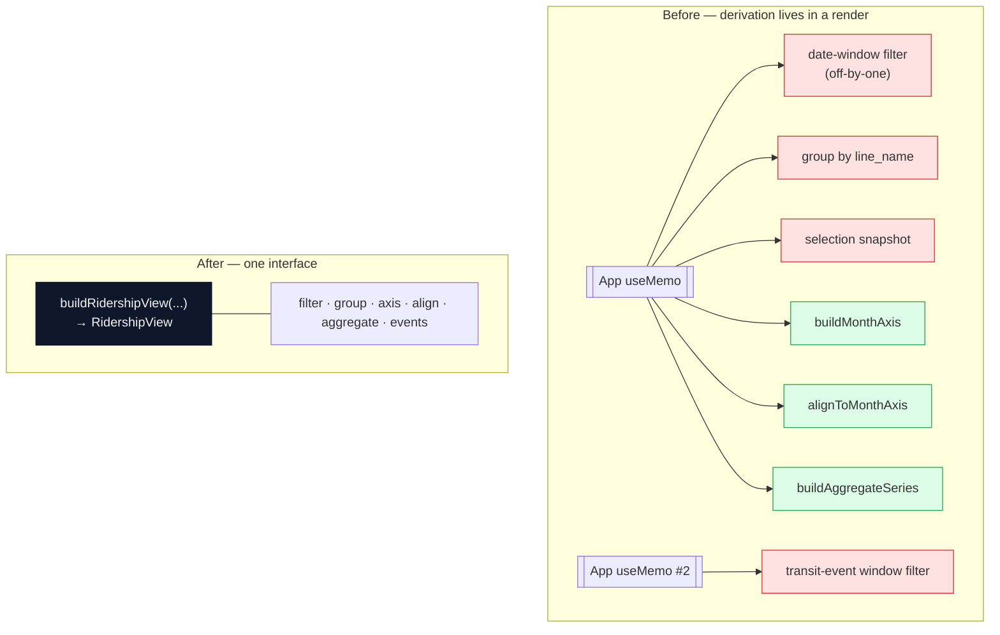
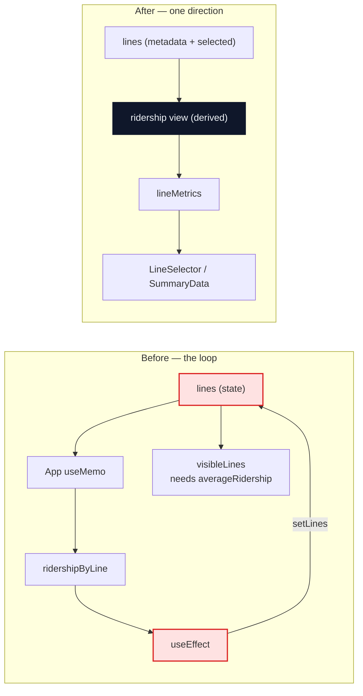
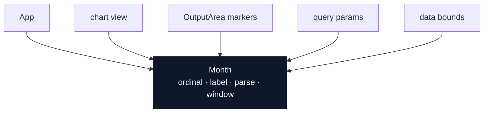
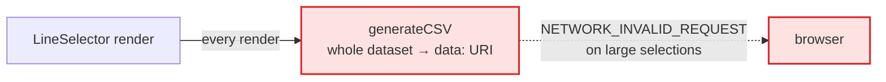

# Architecture review — 2026-08-05

Six deepening candidates for the ridership derivation path: `src/App.tsx`, the dashboard input
hook, and the chart/calc modules. That path is the codebase's hot spot — it carries #74, #85,
#86, #92, #94 and #95.

The vocabulary below is the `/codebase-design` glossary and is used exactly: **module**
(anything with an interface and an implementation), **interface** (everything a caller must know
to use it correctly — not just the type signature), **implementation**, **depth** (behaviour a
caller can exercise per unit of interface learned), **shallow** (interface nearly as complex as
the implementation), **seam** (a place where behaviour can be altered without editing in that
place), **adapter**, **leverage** (what callers gain from depth), **locality** (what maintainers
gain from depth).

At review time neither `CONTEXT.md` nor `docs/adr/` existed, so nothing here contradicts a
recorded decision. The spec sessions below create them lazily as terms and decisions resolve.

## Status

Each candidate runs as a letter pair — a spec session that grills to a settled interface, writes
the domain docs and files tickets; then an implementation session that works those tickets and
opens the PR. Letters run in one series and are never reused. Batch prefix:
`Metro Ridership Architecture / <letter> — <short name>`.

| Letter | Candidate | Session does | Status |
| --- | --- | --- | --- |
| A | 1 — ridership view module | grill → spec → tickets | **done** — #100 (+ #101, #102, #103, #104) |
| B | 1 — ridership view module | implement → PR | **done** — #105, #106, #107, #108 |
| C | 2 — derived metrics off state | grill → spec → tickets | **ready** |
| D | 2 — derived metrics off state | implement → PR | blocked by C |
| E | 3 — collapse `calc.ts` | grill → spec → tickets | **ready** — read PR #93 first |
| F | 3 — collapse `calc.ts` | implement → PR | blocked by E |
| G | 4 — a `Month` module | grill → spec → tickets | **ready** |
| H | 4 — a `Month` module | implement → PR | blocked by G |
| — | 5 — URL contract · 6 — CSV seam | unscheduled | letters assigned when picked up |

Candidate 1 was the frozen contract: it defines the module that 2, 3 and 4 all attach to, so it
landed alone before anything else started. It is now on `main`, which is what unblocked C, E and
G — they are independent of each other and can run in any order, but **not in parallel**. Each
appends to `CONTEXT.md` and claims the next `docs/adr/NNNN` number (0004 is next free), so
concurrent sessions collide on both; and all three are interactive grill sessions, which
serialise on the user's attention regardless of file fencing.

A's outputs are on `main`: `CONTEXT.md` (the repo's first glossary), `docs/adr/0001`–`0003`, and
`src/plans/ridership-view-module.md`. C, E and G should read those before grilling — in
particular ADR-0001, which settles the deliberate month-window offset, and ADR-0003, which
settles why `src/ridership/` is the only domain folder. #104 (duplicated test-data factories)
came out of A but is independent of the module and of every other letter; it landed in #110,
which closed #100 and with it candidate 1. The suite's fixtures now come from
`src/test/builders.ts` — C, E and G should build on those rather than declaring their own.

What B actually landed, since the later letters attach to it: `buildRidershipView` in
`src/ridership/`, whose entire public surface is that one function; `chartData.ts` demoted to
implementation inside the folder; `App.tsx` down to markup and wiring; and the month-window
boundaries plus the transit-event filter under unit test for the first time. Two things B
deliberately did **not** touch, because they belong to later letters:
`updateLinesWithLineMetrics` and its `JSON.stringify` dependency are untouched for C, and
`src/utils/calc.ts` is untouched for E.

---

## 1 — Give the ridership view a module

**Strong** · in-process

**Files** — `src/App.tsx` (L84–186) · `src/ridership/chartData.ts` · `src/data/transit-events.json`

**Problem.** The whole consolidation pipeline is inline in App's render, so every rule in it —
the deliberate off-by-one window, the selection snapshot, the shared month axis — is only
reachable through a React render.

**Solution.** Move the two memos into one module, `buildRidershipView`; `chartData.ts` becomes
its implementation, not its interface.

Red = only reachable by rendering App. Green = reachable from a unit test today.

**Wins**

- Interface shrinks: 6 helpers → 1 call
- Locality: window rules in one module
- Tests drop React entirely
- #86-style regressions get a unit test
- `App.tsx` becomes markup + wiring
- Leverage: chart, map and CSV read one view

**Note.** The transit-event filter has zero unit coverage today — `App.test.tsx` mocks
`OutputArea` and discards the `transitEvents` prop. Extracting it is the cheapest way to get it
under test.

---

## 2 — Stop writing derived metrics back into state

**Strong** · in-process

**Files** — `src/hooks/useUserDashboardInput.ts` (`updateLinesWithLineMetrics`, `isVisibleLine`,
`visibleLines`) · `src/App.tsx` (L193–196)

**Problem.** Derived metrics are stored back into the same state they were derived from, so
`lines` means two things at once — and a line is invisible until the round trip lands
(`isVisibleLine` tests `averageRidership`).

**Solution.** Return metrics from the view module of candidate 1; delete
`updateLinesWithLineMetrics` and the effect that calls it.

Four `JSON.stringify` dependency arrays exist to keep that cycle from spinning.

**Wins**

- Deletes an effect and a setter
- Deletes 4 stringify dependency arrays
- Visibility no longer needs a render pass
- Locality: one meaning per type

---

## 3 — Collapse `calc.ts` into one metrics interface

**Strong** · in-process

**Files** — `src/utils/calc.ts` · `src/utils/calc.test.ts` ·
`src/hooks/useUserDashboardInput.ts` (L193–213)

> **Read PR #93 before grilling E.** It is open against this exact territory and closes #88.
> It already fixes the in-place `metrics.sort()` mutation and the unguarded `sorted[0]`, and it
> takes a deliberate policy decision — *label, don't redefine* — that the "coverage-aware"
> column below assumes rather than argues: metrics keep estimating from each line's own first
> and last record, and the UI stops claiming they all describe the same period. Re-anchoring
> them to the window endpoints is explicitly deferred there as its own decision. E should either
> build on that policy or reopen it on purpose, not rediscover it.
>
> Two mechanical notes: #93 predates the candidate 1 work, so it edits `src/utils/chartData.ts`,
> which #106 moved to `src/ridership/`, and it touches `SummaryData.test.tsx` and
> `useUserDashboardInput.test.ts`, whose fixtures #110 rewrote. It needs a rebase before either
> it or E can land. Whichever goes second absorbs that cost — worth deciding the order up front.

**Problem.** Five exports that always fire together, each re-sorting the caller's array **in
place**, and the caller must know to skip `calcRidersPerMile` when distance is missing. The
module is shallow — its interface is nearly as complex as its implementation.

`metrics.sort()` mutates the caller's `ridershipRecords`, which is the same array the chart
reads. That is the mutation leaking across the seam.

**Solution.** One function, `lineMetrics(records, dayOfWeek) → LineMetrics`. Sorts once on a
copy; the ordering, the null handling and the missing-distance rule move inside. Issue #88's
coverage-awareness gets exactly one place to land.

| | Before | After |
| --- | --- | --- |
| interface | 5 exports | 1 export |
| implementation | ~50 lines, sorts 4× | sorts once, coverage-aware |
| depth | shallow | deep |

**Wins**

- Interface 5 → 1
- Mutation stops crossing the seam
- Issue #88 lands in one module
- Caller loses a conditional

---

## 4 — One representation of a month

**Strong** · in-process

**Files** — `src/App.tsx` · `src/ridership/chartData.ts` (`timeKey`) ·
`src/components/OutputArea.tsx` (`eventMarkers`, `formatMonthLabel`) · `src/utils/queryParams.ts`
· `src/utils/dataDateRange.ts`

**Problem.** A month is encoded five ways, and the chart-label format is re-derived independently
in `OutputArea` — if `timeKey` ever changes, the event markers silently stop matching.

| Site | Encoding |
| --- | --- |
| `App.tsx` date filter | `new Date(y, m)` — 0-based |
| `App.tsx` event filter | `y * 100 + m` — inclusive |
| `chartData.timeKey` | `"YYYY M"` |
| `chartData` axis sort | `y * 12 + m` |
| `transit-events.json` | `"YYYY-MM"` |
| `queryParams` | `"YYYY-MM"` → `Date` |

**Solution.** A `Month` module owning the ordinal, the chart label, both parse formats, and
window containment.

**Wins**

- Label format stops being duplicated
- Off-by-one stated once, tested once
- New event types can't drift (#95)
- Leverage: 5 call sites, 1 interface

The exclusive-end / off-by-one convention becomes a stated rule with a test, instead of a comment
repeated in three files.

---

## 5 — Put the URL contract behind one interface

**Worth exploring** · local-substitutable

**Files** — `src/hooks/useUserDashboardInput.ts` (L92–168) · `src/utils/queryParams.ts` ·
`src/App.tsx` (L227)

**Problem.** The shareable-URL contract has no module — it is split between eight `useState`
initializers and one effect, so it can only be exercised through a jsdom render.
`queryParams.ts` holds format helpers only, and is shallow. The hook's 20-member interface is
then spread wholesale into `LineSelector`, seven raw setters included.

**Solution.** A `dashboardParams` module with `read(search) → DashboardInput` and
`write(input) → string`; the hook keeps React state and stops exposing raw setters.

Two adapters justify the seam: `window.location` in the app, a plain string in tests.

**Wins**

- Round-trip testable as pure strings
- New param = one module, not nine sites
- Hook interface shrinks from 20
- Locality: URL rules in one place

---

## 6 — A seam for CSV export

**Speculative** · ports & adapters

**Files** — `src/utils/lines.ts` (`generateCSV`) · `src/components/LineSelector.tsx` (L365)

**Problem.** `generateCSV` runs on every render inside the `href`, and its own comment says the
`data:` URI approach breaks on large selections.

**Solution.** An export module invoked on click, with the URI strategy behind its interface — so
a Blob or a backend can replace it without touching the caller.

> Speculative on purpose: today there is one adapter, so the seam is hypothetical. It becomes
> real the first time the export has to leave the browser — which `CLAUDE.md` already
> anticipates.

**Wins**

- Export stops running per render
- Strategy swappable behind interface

---

## Top recommendation

**Candidate 1 — give the ridership view a module.** It unlocks the rest: candidate 2 has
somewhere to return metrics to, candidate 3 gets a single caller, and candidate 4's month rules
get one implementation to live in. It is also the only change that moves the app's core
derivation onto a test surface that isn't a React render.
