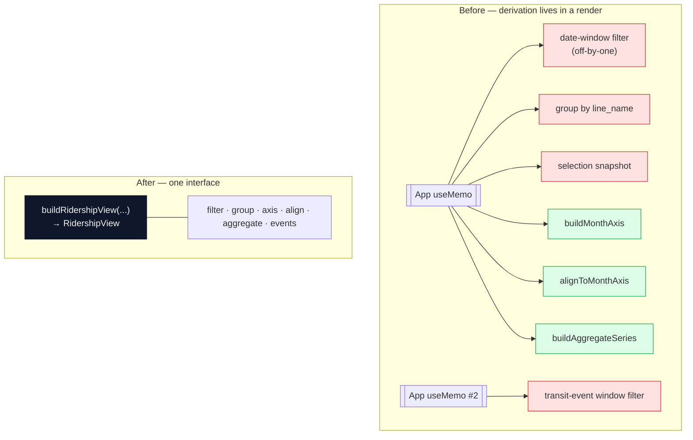
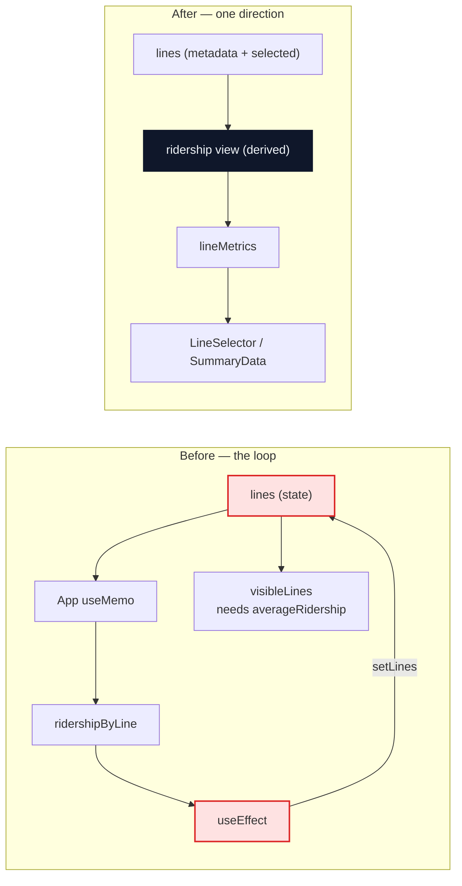
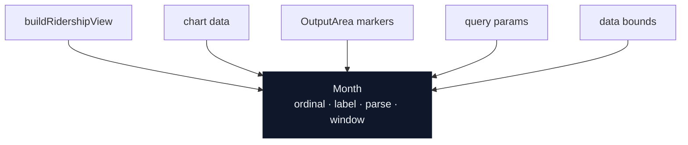
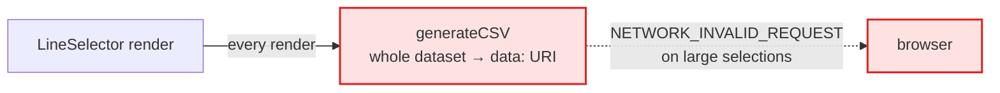

# Architecture review — 2026-08-05

Six deepening candidates for the ridership derivation path: `src/App.tsx`, the dashboard input
hook, and the chart/calc modules. That path is the codebase's hot spot — it carries #74, #85,
#86, #92, #94 and #95.

The vocabulary below is the `/codebase-design` glossary and is used exactly: **module**
(anything with an interface and an implementation), **interface** (everything a caller must know
to use it correctly — not just the type signature), **implementation**, **depth** (behaviour a
caller can exercise per unit of interface learned), **shallow** (interface nearly as complex as
the implementation), **seam** (a place where behaviour can be altered without editing in that
place), **adapter**, **leverage** (what callers gain from depth), **locality** (what maintainers
gain from depth).

At review time neither `CONTEXT.md` nor `docs/adr/` existed, so nothing here contradicts a
recorded decision. The spec sessions below create them lazily as terms and decisions resolve.

## Status

Each candidate runs as a letter **triple** — a spec session that grills to a settled interface,
writes the domain docs and files tickets; an implementation session that works those tickets and
opens the PR; then a review session in a fresh context that reviews that PR. Letters run in one
series and are never reused. Batch prefix:
`Metro Ridership Architecture / <letter> — <short name>`.

| Letter | Candidate | Session does | ADR reserved | Status |
| --- | --- | --- | --- | --- |
| A | 1 — ridership view module | grill → spec → tickets | 0001–0003 | **done** — #100 (+ #101, #102, #103, #104) |
| B | 1 — ridership view module | implement → PR | — | **done** — #105, #106, #107, #108 |
| C | 2 — derived metrics off state | grill → spec → tickets | 0005 | **ready** |
| D | 2 — derived metrics off state | implement → PR | — | blocked by C |
| P | 2 — derived metrics off state | review D's PR | — | blocked by D |
| E | 3 — collapse `calc.ts` | grill → spec → tickets | 0004 | **ready** |
| F | 3 — collapse `calc.ts` | implement → PR | — | blocked by E |
| O | 3 — collapse `calc.ts` | review F's PR | — | blocked by F |
| G | 4 — a `Month` module | grill → spec → tickets | 0006 | **ready** |
| H | 4 — a `Month` module | implement → PR | — | blocked by G |
| Q | 4 — a `Month` module | review H's PR | — | blocked by H |
| — | 5 — URL contract · 6 — CSV seam | unscheduled | — | letters assigned when picked up |

**ADR numbers are pre-assigned deliberately.** E claims 0004, C claims 0005, G claims 0006 —
fixed up front rather than "next free at write time". That is what lets one candidate's grill
session run concurrently with a *different* candidate's implement session without the two
colliding on `docs/adr/` numbering. Do not renumber, and do not create an ADR for a letter that
isn't yours.

Candidate 1 was the frozen contract: it defines the module that 2, 3 and 4 all attach to, so it
landed alone before anything else started. It is now on `main`, which is what unblocked C, E and
G — they are independent of each other and can run in any order, but **not in parallel**. Each
appends to `CONTEXT.md`, so concurrent sessions collide there (the ADR numbers no longer collide,
because they are reserved in advance — see the table); and all three are interactive grill
sessions, which serialise on the user's attention regardless of file fencing.

**The implement chips can't run in parallel either.** D, F and H all land in overlapping
territory:

- **D vs F is a direct textual conflict.** D deletes `updateLinesWithLineMetrics`
  (`useUserDashboardInput.ts:175-242`) outright, while F rewrites the five `calc` call sites
  *inside that same function body* (`:211-232`). There is no ordering of those two edits that
  doesn't conflict in the file.
- **D vs H overlap across five files** in `src/ridership/` and `src/components/` — D re-points
  the metric consumers, H re-points the month encodings, and they touch the same modules.
- **F vs H are nearly disjoint**, since `calc.ts` holds no month encoding at all: it compares
  `year`/`month` fields directly rather than encoding them.

**The agreed order is F → D → H.** F first, because running D first deletes the very caller F
exists to simplify — `updateLinesWithLineMetrics` is where all five `calc` calls live, so once
it's gone F's premise is gone with it. Collapsing `calc.ts` into a single `lineMetrics` call
*first* also means D has one call to relocate instead of five. H goes last, on the settled shape
of both.

A's outputs are on `main`: `CONTEXT.md` (the repo's first glossary), `docs/adr/0001`–`0003`, and
`src/plans/ridership-view-module.md`. C, E and G should read those before grilling — in
particular ADR-0001, which settles the deliberate month-window offset, and ADR-0003, which
settles why `src/ridership/` is the only domain folder. #104 (duplicated test-data factories)
came out of A but is independent of the module and of every other letter; it landed in #110,
which closed #100 and with it candidate 1. The suite's fixtures now come from
`src/test/builders.ts` — C, E and G should build on those rather than declaring their own.

What B actually landed, since the later letters attach to it: `buildRidershipView` in
`src/ridership/`, whose entire public surface is that one function; `chartData.ts` demoted to
implementation inside the folder; `App.tsx` down to markup and wiring; and the month-window
boundaries plus the transit-event filter under unit test for the first time. Two things B
deliberately did **not** touch, because they belong to later letters:
`updateLinesWithLineMetrics` and its `JSON.stringify` dependency are untouched for C, and
`src/utils/calc.ts` was left for E. `calc.ts` has since changed anyway — PR #93 landed there
after B; see the note under candidate 3 for what that leaves E to decide.

---

## 1 — Give the ridership view a module

**Strong** · in-process

**Files** — `src/App.tsx` (L84–186) · `src/ridership/chartData.ts` · `src/data/transit-events.json`

**Problem.** The whole consolidation pipeline is inline in App's render, so every rule in it —
the deliberate off-by-one window, the selection snapshot, the shared month axis — is only
reachable through a React render.

**Solution.** Move the two memos into one module, `buildRidershipView`; `chartData.ts` becomes
its implementation, not its interface.

Red = only reachable by rendering App. Green = reachable from a unit test today.

**Wins**

- Interface shrinks: 6 helpers → 1 call
- Locality: window rules in one module
- Tests drop React entirely
- #86-style regressions get a unit test
- `App.tsx` becomes markup + wiring
- Leverage: chart, map and CSV read one view

**Note.** The transit-event filter has zero unit coverage today — `App.test.tsx` mocks
`OutputArea` and discards the `transitEvents` prop. Extracting it is the cheapest way to get it
under test.

---

## 2 — Stop writing derived metrics back into state

**Strong** · in-process

**Files** — `src/hooks/useUserDashboardInput.ts` (`updateLinesWithLineMetrics`, `isVisibleLine`,
`visibleLines`) · `src/App.tsx` (L88–96 — the effect that calls it)

The four UI consumers that read the derived fields this candidate strips off `Line`, and so have
to be re-pointed at whatever replaces them: `src/components/LineSelector.tsx:66` (the
`averageRidership` sort column) · `src/components/LineTableRow.tsx:94, 157–165` (sparkline
dependency and the partial-coverage label) · `src/components/SummaryData.tsx:23` (sums
`averageRidership` across the selection) · `src/@types/lines.types.ts:15-34`, which now carries
**eight** derived fields — `averageRidership`, `changeInRidership`, `startingRidership`,
`endingRidership`, `ridersPerMile`, plus `coveredFrom`/`coveredTo`/`isPartialCoverage` added by
#93. Eight fields is the size of the problem: each one is a write-back into the state it was
derived from.

**Problem.** Derived metrics are stored back into the same state they were derived from, so
`lines` means two things at once — and a line is invisible until the round trip lands
(`isVisibleLine` tests `averageRidership`).

**Solution.** Return metrics from the view module of candidate 1; delete
`updateLinesWithLineMetrics` and the effect that calls it.

Four `JSON.stringify` dependency arrays exist to keep that cycle from spinning.

**Wins**

- Deletes an effect and a setter
- Deletes 4 stringify dependency arrays
- Visibility no longer needs a render pass
- Locality: one meaning per type

---

## 3 — Collapse `calc.ts` into one metrics interface

**Strong** · in-process

**Files** — `src/utils/calc.ts` · `src/utils/calc.test.ts` ·
`src/hooks/useUserDashboardInput.ts` (L211–232 — the five calc calls plus the distance
conditional)

> **PR #93 has merged** — as `249de8f`, the current tip of `main`. It rebased itself onto the
> candidate 1 work on the way in, so the rebase-ordering question this note used to raise is
> resolved; E has nothing to sequence against. What it changed under E's feet:
>
> - **`sortChronologically` is extracted** (`calc.ts:30-38`) and copies before sorting, so the
>   in-place `metrics.sort()` mutation no longer crosses the seam. The mutation win below is
>   already banked.
> - **Empty-array guards are in**, fixing the unguarded `sorted[0]` in `calcAbsChange`,
>   `calcStart` and `calcEnd`.
> - **Issue #88 is closed** by a deliberate policy decision — *label, don't redefine*. Metrics
>   keep estimating from each line's own first and last record; the UI stops claiming they all
>   describe the same period. Re-anchoring them to the window endpoints is explicitly deferred
>   there as its own decision.
>
> The crucial placement detail: that policy is implemented as a labelling layer in
> `src/ridership/chartData.ts` (`buildCoverageByLine`, `formatMonthKey`), **not** in `calc.ts`.
> Coverage-awareness deliberately does not live in the metrics module — so "#88 lands in
> `calc.ts`" is no longer part of this candidate's job. E should either build on that policy or
> reopen it on purpose, not rediscover it.

**Problem.** Five exports that always fire together, each re-sorting a copy of the caller's array
independently, and the caller must know to skip `calcRidersPerMile` when distance is missing. The
module is shallow — its interface is nearly as complex as its implementation.

Since #93 the sort is a copy-then-sort inside `sortChronologically`, so it no longer mutates the
caller's `ridershipRecords`. The cost that remains is redundancy, not corruption: one call site
that wants all five metrics for one line triggers three separate copy-and-sorts of the same
records (`useUserDashboardInput.ts:215`, `:220`, `:225`).

**Solution.** One function, `lineMetrics(records, dayOfWeek) → LineMetrics`. Sorts once on a
copy; the ordering, the null handling and the missing-distance rule move inside.

| | Before | After |
| --- | --- | --- |
| interface | 5 exports | 1 export |
| implementation | ~77 lines, 3 copy-and-sorts per line | one copy-and-sort per line |
| depth | shallow | deep |
| return type | five loose `number`s | a named `LineMetrics` |

**What #93 already banked, and what is left.** The mutation-across-the-seam win and the
`sorted[0]` guards are done; #88 is closed, and its coverage-awareness landed in
`src/ridership/chartData.ts` rather than here, so it is no longer this candidate's to place.
What remains for candidate 3 is exactly four things:

1. **Five exports → one.** `calcAvg`, `calcAbsChange`, `calcStart`, `calcEnd`,
   `calcRidersPerMile` collapse behind `lineMetrics`.
2. **One sort instead of three.** The hook still triggers three copy-and-sorts per line per
   render (`useUserDashboardInput.ts:215/220/225`); one call sorts once and reads both endpoints
   off the same array.
3. **Absorb the `distanceMiles` conditional** (`useUserDashboardInput.ts:230-232`) — the
   missing-distance rule becomes the module's, not the caller's.
4. **Define a `LineMetrics` type**, so the five fields travel as one named shape instead of five
   separate assignments onto `Line`. This is also the type candidate 2 (letters C/D) needs to
   return metrics *as* rather than write back into state — worth agreeing its shape across both.

**Wins**

- Interface 5 → 1
- Three redundant sorts per line → one
- Caller loses a conditional
- A named return type both this candidate and candidate 2 can hold onto

---

## 4 — One representation of a month

**Strong** · in-process

**Files** — `src/ridership/buildRidershipView.ts` (L94, L186–187) · `src/ridership/chartData.ts`
(`timeKey`, `formatMonthKey`) · `src/components/OutputArea.tsx` (`eventMarkers`,
`formatMonthLabel`) · `src/utils/queryParams.ts` · `src/utils/dataDateRange.ts`

`src/App.tsx` is **not** on this list: candidate 1 moved both of its month encodings into
`buildRidershipView.ts`, and App now contains no month arithmetic at all.

**Problem.** A month is encoded six ways, and the chart-label format is re-derived independently
in `OutputArea` — if `timeKey` ever changes, the event markers silently stop matching.

| Site | Encoding |
| --- | --- |
| `buildRidershipView.ts:94` date filter | `new Date(y, m)` — 0-based |
| `buildRidershipView.ts:186-187` event filter | `y * 100 + m` — inclusive |
| `chartData.timeKey` | `"YYYY M"` |
| `chartData.formatMonthKey` (added by #93) | `"YYYY M"` → `"YYYY-MM"` |
| `chartData` axis sort | `y * 12 + m` |
| `transit-events.json` | `"YYYY-MM"` |
| `queryParams` | `"YYYY-MM"` → `Date` |

`formatMonthKey` is the newest arrival and the clearest argument for the candidate: it exists only
to translate one of these encodings into another, which is the shape of problem a `Month` module
removes rather than adds a converter for.

**Solution.** A `Month` module owning the ordinal, the chart label, both parse formats, and
window containment.

**Wins**

- Label format stops being duplicated
- Off-by-one stated once, tested once
- New event types can't drift (#95)
- Leverage: 6 encodings, 1 interface

The exclusive-end / off-by-one convention becomes a stated rule with a test, instead of a comment
repeated in three files.

---

## 5 — Put the URL contract behind one interface

**Worth exploring** · local-substitutable

**Files** — `src/hooks/useUserDashboardInput.ts` (L92–168) · `src/utils/queryParams.ts` ·
`src/App.tsx` (L227)

**Problem.** The shareable-URL contract has no module — it is split between eight `useState`
initializers and one effect, so it can only be exercised through a jsdom render.
`queryParams.ts` holds format helpers only, and is shallow. The hook's 20-member interface is
then spread wholesale into `LineSelector`, seven raw setters included.

**Solution.** A `dashboardParams` module with `read(search) → DashboardInput` and
`write(input) → string`; the hook keeps React state and stops exposing raw setters.

Two adapters justify the seam: `window.location` in the app, a plain string in tests.

**Wins**

- Round-trip testable as pure strings
- New param = one module, not nine sites
- Hook interface shrinks from 20
- Locality: URL rules in one place

---

## 6 — A seam for CSV export

**Speculative** · ports & adapters

**Files** — `src/utils/lines.ts` (`generateCSV`) · `src/components/LineSelector.tsx` (L365)

**Problem.** `generateCSV` runs on every render inside the `href`, and its own comment says the
`data:` URI approach breaks on large selections.

**Solution.** An export module invoked on click, with the URI strategy behind its interface — so
a Blob or a backend can replace it without touching the caller.

> Speculative on purpose: today there is one adapter, so the seam is hypothetical. It becomes
> real the first time the export has to leave the browser — which `CLAUDE.md` already
> anticipates.

**Wins**

- Export stops running per render
- Strategy swappable behind interface

---

## Top recommendation

**Candidate 1 — give the ridership view a module.** It unlocks the rest: candidate 2 has
somewhere to return metrics to, candidate 3 gets a single caller, and candidate 4's month rules
get one implementation to live in. It is also the only change that moves the app's core
derivation onto a test surface that isn't a React render.
