<!--
  GENERATED FILE — do not edit. Built by scripts/build_architecture_docs.mjs.
  Edit the diagram in docs/architecture/mermaid/<name>.mmd or the prose in
  docs/architecture/captions.md, then run `npm run docs:architecture`.
-->

# metro_ridership_app — architecture

A whole-system view plus one diagram per subsystem. GitHub renders the fences below;
`architecture.html` and `architecture.pdf` in this folder are the same content, rendered.

## Contents

1. [The whole system](#the-whole-system)
2. [Repository map](#repository-map)
3. [The Python data pipeline](#the-python-data-pipeline)
4. [The build pipeline](#the-build-pipeline)
5. [Loading and deriving](#loading-and-deriving)
6. [Consuming the view, and the write-back](#consuming-the-view-and-the-write-back)
7. [Component tree](#component-tree)
8. [State slices](#state-slices)
9. [Mutators, effects, and local state](#mutators-effects-and-local-state)
10. [The URL contract](#the-url-contract)
11. [Domain type model](#domain-type-model)
12. [The `src/ridership/` seam](#the-srcridership-seam)
13. [Month Window, Event Window, Month Axis](#month-window-event-window-month-axis)
14. [Line colour resolution](#line-colour-resolution)
15. [Map lifecycle](#map-lifecycle)
16. [Map interaction and the test seam](#map-interaction-and-the-test-seam)
17. [Unit and Python suites](#unit-and-python-suites)
18. [Visual regression](#visual-regression)
19. [CI pipeline](#ci-pipeline)
20. [Selecting a line, end to end](#selecting-a-line-end-to-end)
21. [Documentation and decision map](#documentation-and-decision-map)

---

## The whole system

The one view that contains everything else. Three stages, and the boundaries between them are
what matter: a **Python pipeline** that runs by hand and writes JSON into the repo, a **Vite
build** that re-encodes that JSON into a wire format, and a **browser** that derives everything on
screen from one set of user choices.

There is no backend. The repository *is* the database, `dist/` is the whole deployment, and the
URL query string is the only thing that survives a reload. Every remaining diagram drills into one
box here.

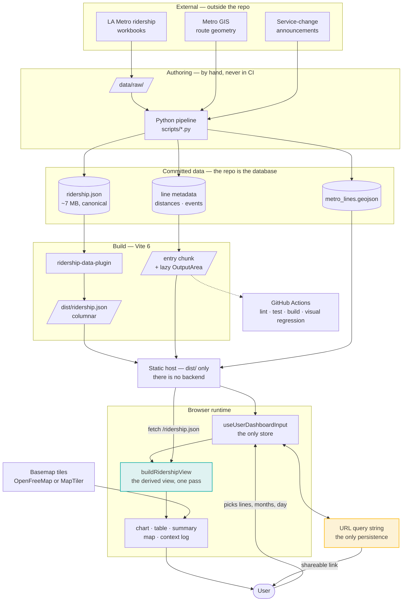
```mermaid
flowchart TB
  subgraph ext["External — outside the repo"]
    direction LR
    metroXlsx["LA Metro ridership<br/>workbooks"]
    metroGis["Metro GIS<br/>route geometry"]
    announce["Service-change<br/>announcements"]
  end

  subgraph authoring["Authoring — by hand, never in CI"]
    direction LR
    raw[/"data/raw/"/]
    py["Python pipeline<br/>scripts/*.py"]
    raw --> py
  end

  subgraph committed["Committed data — the repo is the database"]
    direction LR
    canonical[("ridership.json<br/>~7 MB, canonical")]
    meta[("line metadata<br/>distances · events")]
    geo[("metro_lines.geojson")]
  end

  subgraph build["Build — Vite 6"]
    direction LR
    plugin["ridership-data-plugin"]
    columnar[/"dist/ridership.json<br/>columnar"/]
    chunks[/"entry chunk<br/>+ lazy OutputArea"/]
    plugin --> columnar
  end

  host["Static host — dist/ only<br/>there is no backend"]

  subgraph browser["Browser runtime"]
    direction LR
    hook["useUserDashboardInput<br/>the only store"]
    view["buildRidershipView<br/>the derived view, one pass"]
    ui["chart · table · summary<br/>map · context log"]
    hook --> view --> ui
  end

  urlbar["URL query string<br/>the only persistence"]
  user(["User"])
  tiles["Basemap tiles<br/>OpenFreeMap or MapTiler"]
  ci["GitHub Actions<br/>lint · test · build · visual regression"]

  metroXlsx --> raw
  metroGis --> py
  announce --> py
  py --> canonical
  py --> meta
  py --> geo

  canonical --> plugin
  meta --> chunks
  columnar --> host
  chunks --> host
  geo --> host

  host --> hook
  host -- "fetch /ridership.json" --> view
  tiles --> ui

  ui --> user
  user -- "picks lines, months, day" --> hook
  hook <--> urlbar
  urlbar -- "shareable link" --> user

  chunks -.-> ci

  classDef key fill:#dff2f1,stroke:#0fada8,stroke-width:1.5px,color:#44403c
  classDef pending fill:#fdf2d6,stroke:#fdb913,stroke-width:1.5px,color:#44403c
  class view key
  class urlbar pending
```

---

## Repository map

What lives where. Two things are worth noticing. `src/` is flat — `components/`, `hooks/`,
`utils/`, `data/`, `@types/` — with exactly one domain folder, `src/ridership/`, and ADR-0003 says
that is deliberate rather than the first step of a reorganisation. And the repo carries an unusual
amount of prose: `CONTEXT.md`, six ADRs, an architecture review, seven design plans. That is the
system's memory; read it before changing behaviour that looks wrong.

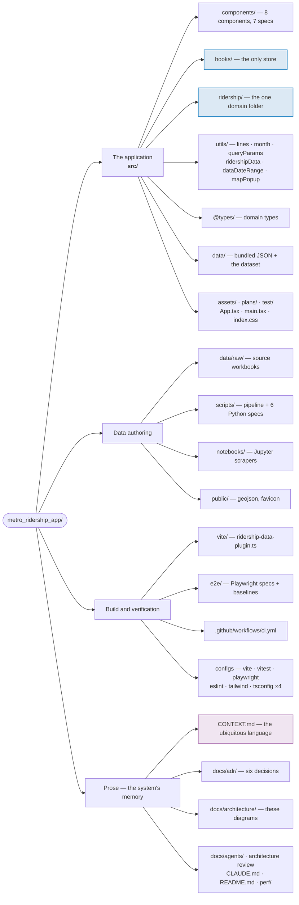
```mermaid
flowchart LR
  root(["metro_ridership_app/"])

  app["The application<br/><b>src/</b>"]
  pipeline["Data authoring"]
  tooling["Build and verification"]
  writing["Prose — the system's memory"]

  root --> app
  root --> pipeline
  root --> tooling
  root --> writing

  app --> cmp["components/ — 8 components, 7 specs"]
  app --> hooks["hooks/ — the only store"]
  app --> rid["ridership/ — the one domain folder"]
  app --> utils["utils/ — lines · month · queryParams<br/>ridershipData · dataDateRange · mapPopup"]
  app --> types["@types/ — domain types"]
  app --> dataDir["data/ — bundled JSON + the dataset"]
  app --> misc["assets/ · plans/ · test/<br/>App.tsx · main.tsx · index.css"]

  pipeline --> dataN["data/raw/ — source workbooks"]
  pipeline --> scriptsN["scripts/ — pipeline + 6 Python specs"]
  pipeline --> nbN["notebooks/ — Jupyter scrapers"]
  pipeline --> publicN["public/ — geojson, favicon"]

  tooling --> viteN["vite/ — ridership-data-plugin.ts"]
  tooling --> e2eN["e2e/ — Playwright specs + baselines"]
  tooling --> ghN[".github/workflows/ci.yml"]
  tooling --> cfgN["configs — vite · vitest · playwright<br/>eslint · tailwind · tsconfig ×4"]

  writing --> ctxN["CONTEXT.md — the ubiquitous language"]
  writing --> adrN["docs/adr/ — six decisions"]
  writing --> archN["docs/architecture/ — these diagrams"]
  writing --> otherN["docs/agents/ · architecture review<br/>CLAUDE.md · README.md · perf/"]

  classDef structural fill:#dce9f4,stroke:#0072bc,stroke-width:1.5px,color:#44403c
  classDef authority fill:#f0e5f1,stroke:#a05da5,stroke-width:1.5px,color:#44403c
  class rid,hooks structural
  class ctxN authority
```

---

## The Python data pipeline

How data gets into the repo: three independent chains, left to right. Nothing here runs in CI — a
human runs these scripts and commits the result, which is why `src/data/ridership.json` is a
checked-in 7 MB file rather than a build artifact.

`update_ridership.py` is the incremental path: when Metro publishes a single new month, it merges
that month into the canonical file instead of rebuilding it from every workbook. Every script has
a `test_*.py` sibling — six in all.

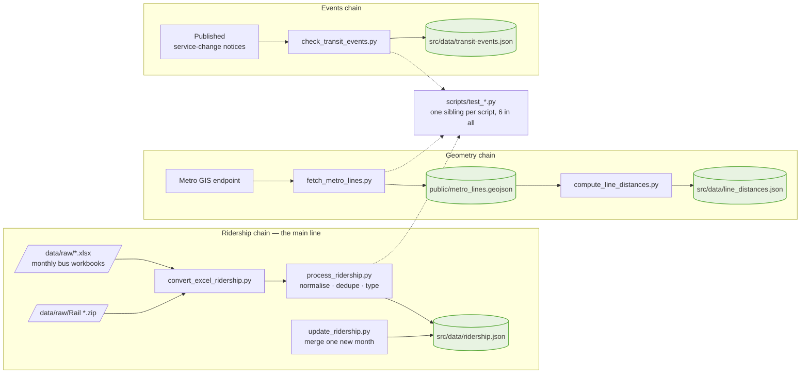
```mermaid
flowchart LR
  subgraph ridershipChain["Ridership chain — the main line"]
    direction LR
    xlsx[/"data/raw/*.xlsx<br/>monthly bus workbooks"/]
    zips[/"data/raw/Rail *.zip"/]
    convert["convert_excel_ridership.py"]
    process["process_ridership.py<br/>normalise · dedupe · type"]
    update["update_ridership.py<br/>merge one new month"]
    ridJson[("src/data/ridership.json")]

    xlsx --> convert
    zips --> convert
    convert --> process
    process --> ridJson
    update --> ridJson
  end

  subgraph geometry["Geometry chain"]
    direction LR
    gisapi["Metro GIS endpoint"]
    fetchLines["fetch_metro_lines.py"]
    geojson[("public/metro_lines.geojson")]
    distances["compute_line_distances.py"]
    distJson[("src/data/line_distances.json")]

    gisapi --> fetchLines --> geojson --> distances --> distJson
  end

  subgraph eventsChain["Events chain"]
    direction LR
    sources["Published<br/>service-change notices"]
    checkEvents["check_transit_events.py"]
    events[("src/data/transit-events.json")]

    sources --> checkEvents --> events
  end

  tests["scripts/test_*.py<br/>one sibling per script, 6 in all"]

  process -.-> tests
  fetchLines -.-> tests
  checkEvents -.-> tests

  classDef surface fill:#e8f3e2,stroke:#58a738,stroke-width:1.5px,color:#44403c
  class ridJson,geojson,distJson,events surface
```

---

## The build pipeline

`vite/ridership-data-plugin.ts` is the interesting part. The canonical JSON repeats six field
names on every one of ~42K rows and, imported normally, would inline about 6.6 MB of object
literal into the entry chunk. The plugin reads it once and produces two things from that single
cached pass: a minified columnar blob served at `/ridership.json`, and a `virtual:ridership-bounds`
module carrying just the min/max year and latest month.

The blob reaches the app two different ways — dev middleware in `configureServer`, an emitted
asset in `generateBundle` — so the runtime `fetch` is identical in both. The plugin is registered
in `vitest.config.ts` as well, or the virtual module would not resolve under the test runner.

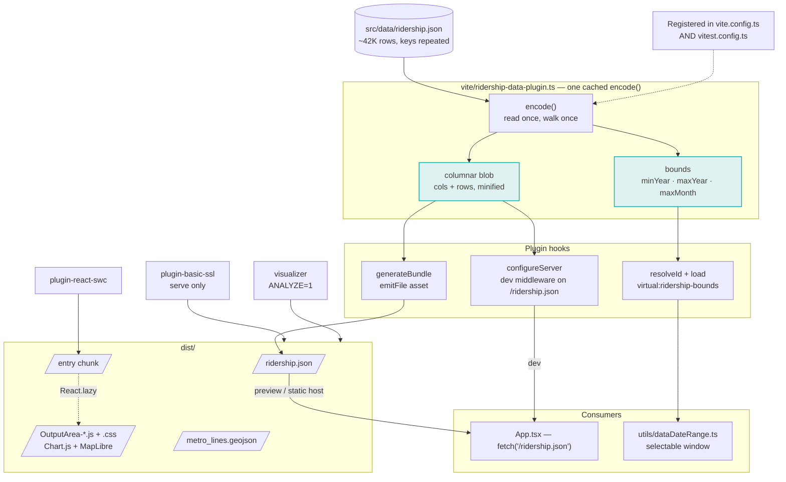
```mermaid
flowchart TB
  canonical[("src/data/ridership.json<br/>~42K rows, keys repeated")]

  subgraph plugin["vite/ridership-data-plugin.ts — one cached encode()"]
    direction TB
    encode["encode()<br/>read once, walk once"]
    blob["columnar blob<br/>cols + rows, minified"]
    bounds["bounds<br/>minYear · maxYear · maxMonth"]
    encode --> blob
    encode --> bounds
  end

  subgraph hooks["Plugin hooks"]
    direction TB
    configureServer["configureServer<br/>dev middleware on /ridership.json"]
    generateBundle["generateBundle<br/>emitFile asset"]
    resolveLoad["resolveId + load<br/>virtual:ridership-bounds"]
  end

  subgraph out["dist/"]
    direction TB
    ridAsset[/"ridership.json"/]
    entryChunk[/"entry chunk"/]
    lazyChunk[/"OutputArea-*.js + .css<br/>Chart.js + MapLibre"/]
    geoAsset[/"metro_lines.geojson"/]
  end

  subgraph consumers["Consumers"]
    direction TB
    appFetch["App.tsx — fetch('/ridership.json')"]
    dateRange["utils/dataDateRange.ts<br/>selectable window"]
  end

  swc["plugin-react-swc"]
  ssl["plugin-basic-ssl<br/>serve only"]
  vis["visualizer<br/>ANALYZE=1"]
  registered["Registered in vite.config.ts<br/>AND vitest.config.ts"]

  canonical --> encode
  blob --> configureServer
  blob --> generateBundle
  bounds --> resolveLoad

  generateBundle --> ridAsset
  configureServer -- "dev" --> appFetch
  ridAsset -- "preview / static host" --> appFetch
  resolveLoad --> dateRange

  swc --> entryChunk
  entryChunk -. "React.lazy" .-> lazyChunk
  ssl --> out
  vis --> out
  registered -.-> encode

  classDef key fill:#dff2f1,stroke:#0fada8,stroke-width:1.5px,color:#44403c
  class blob,bounds key
```

---

## Loading and deriving

The core architecture, first half. Records are fetched rather than bundled, decoded from the
columnar blob, and handed with the user's choices to a single `buildRidershipView` call that
produces the whole derived view in one pass.

`null` is the loading state, not an empty array — the distinction is what lets the app filter and
show context-log events while the ridership data is still in flight. Note that the metrics loop
iterates `lines`, not the consolidated groups: a record whose `line_name` has no metadata entry
produces a group but no `Line`, and therefore no figures.

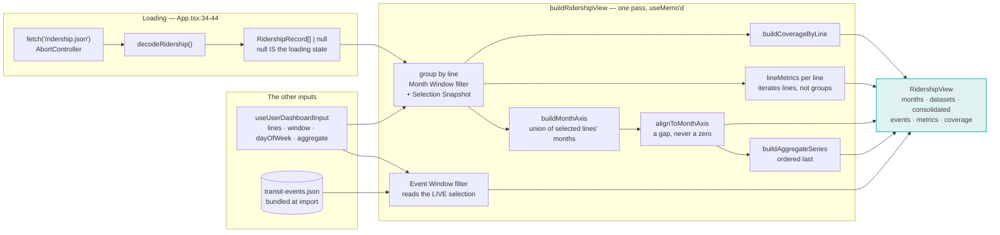
```mermaid
flowchart LR
  subgraph loading["Loading — App.tsx:34-44"]
    direction TB
    fetchCall["fetch('/ridership.json')<br/>AbortController"]
    decode["decodeRidership()"]
    records["RidershipRecord[] | null<br/>null IS the loading state"]
    fetchCall --> decode --> records
  end

  subgraph inputs["The other inputs"]
    direction TB
    hook["useUserDashboardInput<br/>lines · window · dayOfWeek · aggregate"]
    eventsJson[("transit-events.json<br/>bundled at import")]
  end

  subgraph derive["buildRidershipView — one pass, useMemo'd"]
    direction TB
    group["group by line<br/>Month Window filter<br/>+ Selection Snapshot"]
    cover["buildCoverageByLine"]
    metricsLoop["lineMetrics per line<br/>iterates lines, not groups"]
    axis["buildMonthAxis<br/>union of selected lines' months"]
    align["alignToMonthAxis<br/>a gap, never a zero"]
    agg["buildAggregateSeries<br/>ordered last"]
    evfilter["Event Window filter<br/>reads the LIVE selection"]

    group --> cover
    group --> metricsLoop
    group --> axis --> align --> agg
  end

  view["RidershipView<br/>months · datasets · consolidated<br/>events · metrics · coverage"]

  records --> group
  hook --> group
  hook --> evfilter
  eventsJson --> evfilter

  cover --> view
  metricsLoop --> view
  align --> view
  agg --> view
  evfilter --> view

  classDef key fill:#dff2f1,stroke:#0fada8,stroke-width:1.5px,color:#44403c
  class view key
```

---

## Consuming the view, and the write-back

The second half, and the one live design problem in the app.

`buildRidershipView` already returns `metrics` and `coverage` keyed by line id — everything a
caller needs — yet `App.tsx:94` still calls `updateLinesWithLineMetrics`, which writes eight
derived fields back onto every `Line`. That mints a new `lines` array, which re-enters the memo it
came from; the `JSON.stringify` dependency keys exist to keep the loop from thrashing. It settles
only because the second pass produces figures identical to the first.

ADR-0005 accepted removing it. `buildLineReadouts` and `listedReadouts` are the replacement —
written, unit-tested, and imported by nothing that renders.

`LineSelector` reads `consolidated` directly and builds its own axis, because the table draws a
sparkline for every *visible* line while the chart covers only the *selected* ones.

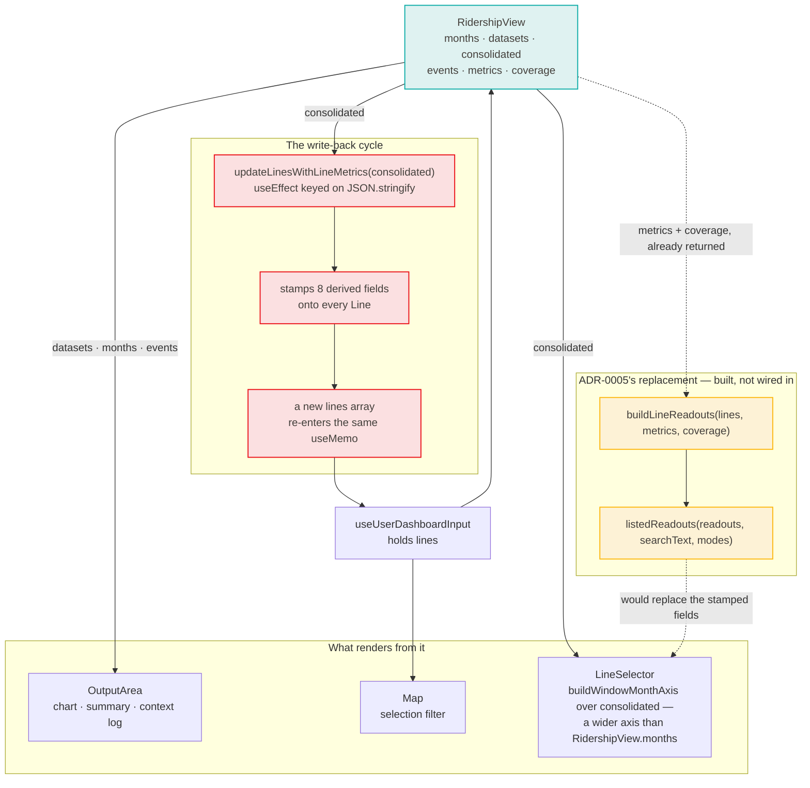
```mermaid
flowchart TB
  view["RidershipView<br/>months · datasets · consolidated<br/>events · metrics · coverage"]

  subgraph rendering["What renders from it"]
    direction TB
    outputArea["OutputArea<br/>chart · summary · context log"]
    mapCmp["Map<br/>selection filter"]
    lineSelector["LineSelector<br/>buildWindowMonthAxis over consolidated —<br/>a wider axis than RidershipView.months"]
  end

  subgraph loop["The write-back cycle"]
    direction TB
    writeback["updateLinesWithLineMetrics(consolidated)<br/>useEffect keyed on JSON.stringify"]
    stamp["stamps 8 derived fields<br/>onto every Line"]
    fresh["a new lines array<br/>re-enters the same useMemo"]
    writeback --> stamp --> fresh
  end

  hook["useUserDashboardInput<br/>holds lines"]

  subgraph replacement["ADR-0005's replacement — built, not wired in"]
    direction TB
    readouts["buildLineReadouts(lines, metrics, coverage)"]
    listed["listedReadouts(readouts, searchText, modes)"]
    readouts --> listed
  end

  view -- "datasets · months · events" --> outputArea
  view -- "consolidated" --> lineSelector
  view -- "consolidated" --> writeback
  fresh --> hook
  hook --> mapCmp
  hook --> view

  view -. "metrics + coverage, already returned" .-> readouts
  listed -. "would replace the stamped fields" .-> lineSelector

  classDef key fill:#dff2f1,stroke:#0fada8,stroke-width:1.5px,color:#44403c
  classDef cycle fill:#fbe0e1,stroke:#eb131b,stroke-width:1.5px,color:#44403c
  classDef pending fill:#fdf2d6,stroke:#fdb913,stroke-width:1.5px,color:#44403c
  class view key
  class writeback,stamp,fresh cycle
  class readouts,listed pending
```

---

## Component tree

Eight components, no router, no context providers. `App` spreads the entire hook state into
`LineSelector` with `{...userDashboardInputState}`, so that component's real interface is far wider
than its props list suggests.

`OutputArea` is `React.lazy` on purpose: it pulls in Chart.js and MapLibre, and keeping them out of
the entry chunk lets the header and line table paint first. Note the gate — expanding the line
selector *unmounts* `OutputArea` rather than hiding it, so the chart and map rebuild from scratch
on collapse. `App.tsx:136-138` flags this.

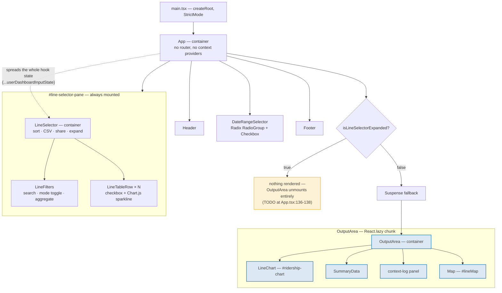
```mermaid
flowchart TB
  main["main.tsx — createRoot, StrictMode"]
  app["App — container<br/>no router, no context providers"]
  header["Header"]
  drs["DateRangeSelector<br/>Radix RadioGroup + Checkbox"]

  subgraph leftPane["#line-selector-pane — always mounted"]
    direction TB
    ls["LineSelector — container<br/>sort · CSV · share · expand"]
    lf["LineFilters<br/>search · mode toggle · aggregate"]
    ltr["LineTableRow × N<br/>checkbox + Chart.js sparkline"]
    ls --> lf
    ls --> ltr
  end

  gate{"isLineSelectorExpanded?"}
  unmounted["nothing rendered —<br/>OutputArea unmounts entirely<br/>(TODO at App.tsx:136-138)"]
  susp["Suspense fallback"]

  subgraph rightPane["OutputArea — React.lazy chunk"]
    direction TB
    oa["OutputArea — container"]
    chart["LineChart — #ridership-chart"]
    summary["SummaryData"]
    ctxlog["context-log panel"]
    mapCmp["Map — #lineMap"]
    oa --> chart
    oa --> summary
    oa --> ctxlog
    oa --> mapCmp
  end

  footer["Footer"]

  main --> app
  app --> header
  app --> drs
  app --> leftPane
  app --> gate
  gate -- "true" --> unmounted
  gate -- "false" --> susp --> oa
  app --> footer

  app -. "spreads the whole hook state<br/>{...userDashboardInputState}" .-> ls

  classDef structural fill:#dce9f4,stroke:#0072bc,stroke-width:1.5px,color:#44403c
  classDef pending fill:#fdf2d6,stroke:#fdb913,stroke-width:1.5px,color:#44403c
  class oa,chart,summary,ctxlog,mapCmp structural
  class unmounted pending
```

---

## State slices

All shared state lives in one custom hook: four slices, no Redux, no Zustand, no Context. Each
slice is seeded once from the URL in a lazy `useState` initialiser, so a shared link reconstructs
the view before the first render rather than after it.

`visibleLines` is the only derived value in the store, and its memo key is
`JSON.stringify(lines)` rather than `lines` — see the next diagram for why.

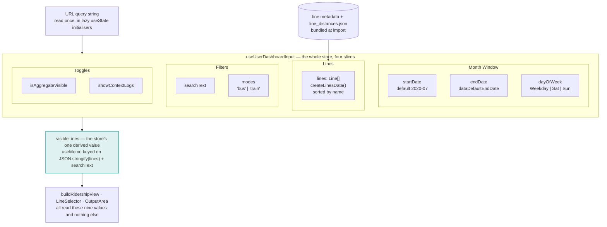
```mermaid
flowchart TB
  urlIn["URL query string<br/>read once, in lazy useState initialisers"]
  bundledMeta[("line metadata + line_distances.json<br/>bundled at import")]

  subgraph store["useUserDashboardInput — the whole store, four slices"]
    direction LR

    subgraph windowSlice["Month Window"]
      direction TB
      startDate["startDate<br/>default 2020-07"]
      endDate["endDate<br/>dataDefaultEndDate"]
      dow["dayOfWeek<br/>Weekday | Sat | Sun"]
    end

    subgraph linesSlice["Lines"]
      direction TB
      lines["lines: Line[]<br/>createLinesData()<br/>sorted by name"]
    end

    subgraph filterSlice["Filters"]
      direction TB
      search["searchText"]
      modes["modes<br/>'bus' | 'train'"]
    end

    subgraph toggleSlice["Toggles"]
      direction TB
      aggregate["isAggregateVisible"]
      logs["showContextLogs"]
    end
  end

  visible["visibleLines — the store's one derived value<br/>useMemo keyed on JSON.stringify(lines) + searchText"]
  consumer["buildRidershipView · LineSelector · OutputArea<br/>all read these nine values and nothing else"]

  urlIn --> store
  bundledMeta --> linesSlice
  store --> visible --> consumer

  classDef key fill:#dff2f1,stroke:#0fada8,stroke-width:1.5px,color:#44403c
  class visible key
```

---

## Mutators, effects, and local state

Everything that writes. Four of the five mutators touch `lines`, which is why that one array is the
hinge the whole store turns on.

The `JSON.stringify` dependency keys at `App.tsx:96`, `useUserDashboardInput.ts:168` and `:264` are
load-bearing, not sloppiness: `lines` is a fresh array on every derivation, so reference equality
would fire these effects forever. `CLAUDE.md` asks you not to "fix" them. The real fix is removing
the write-back that mints the array (ADR-0005), not changing the keys.

What is *not* in the store matters too. Expansion, the fetched records, sort state, the context-log
disclosure and every MapLibre handle stay local, so none of them participate in the derivation
above.

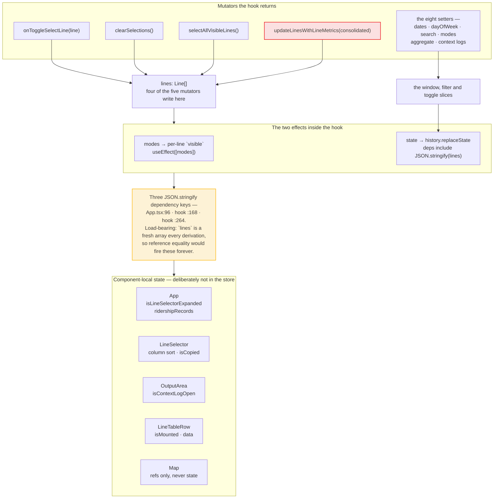
```mermaid
flowchart TB
  subgraph mutators["Mutators the hook returns"]
    direction LR
    toggleLine["onToggleSelectLine(line)"]
    clear["clearSelections()"]
    selectAll["selectAllVisibleLines()"]
    updateMetrics["updateLinesWithLineMetrics(consolidated)"]
    setters["the eight setters —<br/>dates · dayOfWeek · search · modes<br/>aggregate · context logs"]
  end

  lines["lines: Line[]<br/>four of the five mutators write here"]
  otherSlices["the window, filter and toggle slices"]

  subgraph effects["The two effects inside the hook"]
    direction LR
    modeSync["modes → per-line `visible`<br/>useEffect([modes])"]
    urlSync["state → history.replaceState<br/>deps include JSON.stringify(lines)"]
  end

  keys["Three JSON.stringify dependency keys —<br/>App.tsx:96 · hook :168 · hook :264.<br/>Load-bearing: `lines` is a fresh array every derivation,<br/>so reference equality would fire these forever."]

  subgraph local["Component-local state — deliberately not in the store"]
    direction LR
    appLocal["App<br/>isLineSelectorExpanded<br/>ridershipRecords"]
    lsLocal["LineSelector<br/>column sort · isCopied"]
    oaLocal["OutputArea<br/>isContextLogOpen"]
    ltrLocal["LineTableRow<br/>isMounted · data"]
    mapLocal["Map<br/>refs only, never state"]
  end

  toggleLine --> lines
  clear --> lines
  selectAll --> lines
  updateMetrics --> lines
  setters --> otherSlices

  lines --> effects
  otherSlices --> urlSync
  effects --> keys
  keys --> local

  classDef cycle fill:#fbe0e1,stroke:#eb131b,stroke-width:1.5px,color:#44403c
  classDef pending fill:#fdf2d6,stroke:#fdb913,stroke-width:1.5px,color:#44403c
  class updateMetrics cycle
  class keys pending
```

---

## The URL contract

Nine parameters, read once into lazy `useState` initialisers and written back with
`history.replaceState` on every change. No router, no `localStorage`, no server — this is the
app's entire persistence layer, and the reason every view is a shareable link.

The contract is asymmetric by design: `buses`/`trains` are written only when *off*,
`aggregate`/`logs` only when *on*, which keeps the common URL short. Malformed values fall back to
defaults rather than throwing. Nine ad-hoc reads and one hand-built writer are what candidate 5 of
the architecture review would replace with an explicit parsed contract; it is unscheduled.

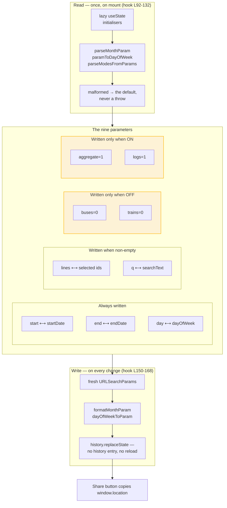
```mermaid
flowchart TB
  subgraph readPath["Read — once, on mount (hook L92-132)"]
    direction LR
    lazyInit["lazy useState<br/>initialisers"]
    parsers["parseMonthParam<br/>paramToDayOfWeek<br/>parseModesFromParams"]
    fallback["malformed → the default,<br/>never a throw"]
    lazyInit --> parsers --> fallback
  end

  subgraph pairs["The nine parameters"]
    direction LR

    subgraph always["Always written"]
      direction TB
      p1["start ⟷ startDate"]
      p2["end ⟷ endDate"]
      p3["day ⟷ dayOfWeek"]
    end

    subgraph whenSet["Written when non-empty"]
      direction TB
      p4["lines ⟷ selected ids"]
      p5["q ⟷ searchText"]
    end

    subgraph whenOff["Written only when OFF"]
      direction TB
      p6["buses=0"]
      p7["trains=0"]
    end

    subgraph whenOn["Written only when ON"]
      direction TB
      p8["aggregate=1"]
      p9["logs=1"]
    end
  end

  subgraph writePath["Write — on every change (hook L150-168)"]
    direction LR
    build["fresh URLSearchParams"]
    formatters["formatMonthParam<br/>dayOfWeekToParam"]
    replace["history.replaceState —<br/>no history entry, no reload"]
    build --> formatters --> replace
  end

  share["Share button copies window.location"]

  fallback --> pairs --> build
  replace --> share

  classDef pending fill:#fdf2d6,stroke:#fdb913,stroke-width:1.5px,color:#44403c
  class whenOff,whenOn pending
```

---

## Domain type model

The types and how they relate. Read `Line` from the top down: identity and metadata first, then a
block of optional derived figures that ADR-0005 says do not belong there. `LineSelection` is the
same information minus that block — it is what `buildRidershipView` actually accepts, and `Line`
satisfies it structurally, which is what keeps derived figures from being handed back into the
module that produced them.

`LineReadout` is the intended destination: `Line & Partial<LineMetrics> & Partial<LineCoverage>`,
derived per window and thrown away. `Month` is ADR-0006's replacement for the seven encodings a
month currently has. Both exist; neither is wired in.

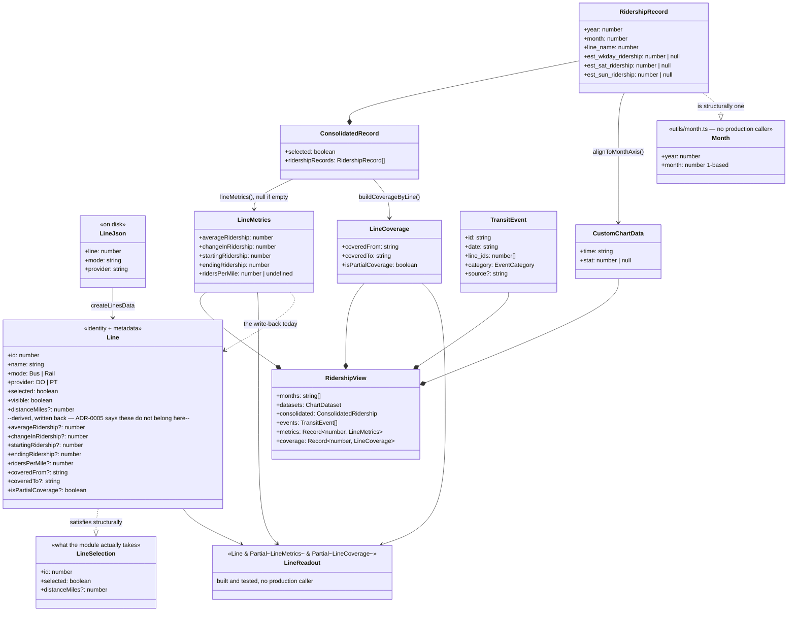
```mermaid
classDiagram
  direction TB

  class LineJson {
    <<on disk>>
    +line: number
    +mode: string
    +provider: string
  }

  class Line {
    <<identity + metadata>>
    +id: number
    +name: string
    +mode: Bus | Rail
    +provider: DO | PT
    +selected: boolean
    +visible: boolean
    +distanceMiles?: number
    --derived, written back — ADR-0005 says these do not belong here--
    +averageRidership?: number
    +changeInRidership?: number
    +startingRidership?: number
    +endingRidership?: number
    +ridersPerMile?: number
    +coveredFrom?: string
    +coveredTo?: string
    +isPartialCoverage?: boolean
  }

  class LineSelection {
    <<what the module actually takes>>
    +id: number
    +selected: boolean
    +distanceMiles?: number
  }

  class RidershipRecord {
    +year: number
    +month: number
    +line_name: number
    +est_wkday_ridership: number | null
    +est_sat_ridership: number | null
    +est_sun_ridership: number | null
  }

  class ConsolidatedRecord {
    +selected: boolean
    +ridershipRecords: RidershipRecord[]
  }

  class LineMetrics {
    +averageRidership: number
    +changeInRidership: number
    +startingRidership: number
    +endingRidership: number
    +ridersPerMile: number | undefined
  }

  class LineCoverage {
    +coveredFrom: string
    +coveredTo: string
    +isPartialCoverage: boolean
  }

  class LineReadout {
    <<Line & Partial~LineMetrics~ & Partial~LineCoverage~>>
    built and tested, no production caller
  }

  class TransitEvent {
    +id: string
    +date: string
    +line_ids: number[]
    +category: EventCategory
    +source?: string
  }

  class CustomChartData {
    +time: string
    +stat: number | null
  }

  class RidershipView {
    +months: string[]
    +datasets: ChartDataset
    +consolidated: ConsolidatedRidership
    +events: TransitEvent[]
    +metrics: Record~number, LineMetrics~
    +coverage: Record~number, LineCoverage~
  }

  class Month {
    <<utils/month.ts — no production caller>>
    +year: number
    +month: number 1-based
  }

  LineJson --> Line : createLinesData
  Line ..|> LineSelection : satisfies structurally
  RidershipRecord --* ConsolidatedRecord
  ConsolidatedRecord --> LineMetrics : lineMetrics(), null if empty
  ConsolidatedRecord --> LineCoverage : buildCoverageByLine()
  RidershipRecord --> CustomChartData : alignToMonthAxis()
  RidershipRecord ..|> Month : is structurally one
  CustomChartData --* RidershipView
  LineMetrics --* RidershipView
  LineCoverage --* RidershipView
  TransitEvent --* RidershipView
  Line --> LineReadout
  LineMetrics --> LineReadout
  LineCoverage --> LineReadout
  LineMetrics ..> Line : the write-back today
```

---

## The `src/ridership/` seam

`index.ts` is the module's entire public surface. Everything else in the folder is implementation,
so an import of `../ridership/chartData` from outside is *visibly* reaching past a seam — which is
the whole point of the folder existing (ADR-0003). A flat `src/utils/ridershipView.ts` could only
have asked for that in a comment.

The month-axis and coverage exports are a deliberate second entry point rather than a leak.
`buildRidershipView` derives the **chart**, over the **selected** lines only; the line table draws
a sparkline for every **visible** line and needs the wider union across all of `consolidated`.

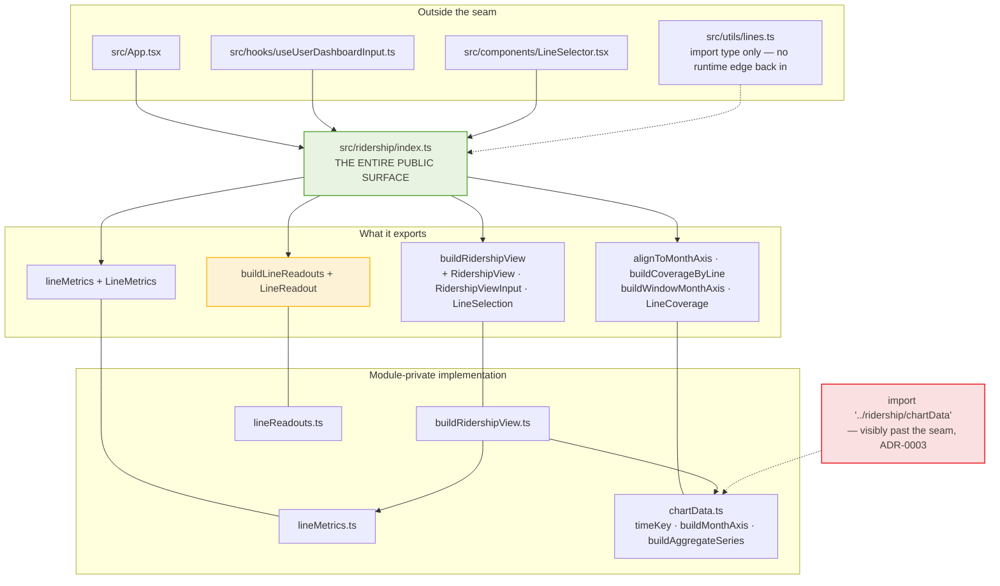
```mermaid
flowchart TB
  subgraph outside["Outside the seam"]
    direction TB
    app["src/App.tsx"]
    hook["src/hooks/useUserDashboardInput.ts"]
    lineSel["src/components/LineSelector.tsx"]
    utilsLines["src/utils/lines.ts<br/>import type only — no runtime edge back in"]
  end

  idx["src/ridership/index.ts<br/>THE ENTIRE PUBLIC SURFACE"]

  subgraph exported["What it exports"]
    direction TB
    brv["buildRidershipView<br/>+ RidershipView · RidershipViewInput · LineSelection"]
    axisExports["alignToMonthAxis · buildCoverageByLine<br/>buildWindowMonthAxis · LineCoverage"]
    lm["lineMetrics + LineMetrics"]
    readouts["buildLineReadouts + LineReadout"]
  end

  subgraph private["Module-private implementation"]
    direction TB
    brvImpl["buildRidershipView.ts"]
    lmImpl["lineMetrics.ts"]
    lrImpl["lineReadouts.ts"]
    chartData["chartData.ts<br/>timeKey · buildMonthAxis · buildAggregateSeries"]
  end

  bad["import '../ridership/chartData'<br/>— visibly past the seam, ADR-0003"]

  app --> idx
  hook --> idx
  lineSel --> idx
  utilsLines -.-> idx

  idx --> brv
  idx --> axisExports
  idx --> lm
  idx --> readouts

  brv --- brvImpl
  lm --- lmImpl
  readouts --- lrImpl
  axisExports --- chartData
  brvImpl --> chartData
  brvImpl --> lmImpl

  bad -.-> chartData

  classDef surface fill:#e8f3e2,stroke:#58a738,stroke-width:1.5px,color:#44403c
  classDef cycle fill:#fbe0e1,stroke:#eb131b,stroke-width:1.5px,color:#44403c
  classDef pending fill:#fdf2d6,stroke:#fdb913,stroke-width:1.5px,color:#44403c
  class idx surface
  class bad cycle
  class readouts pending
```

---

## Month Window, Event Window, Month Axis

The single most surprising thing in the codebase. One user choice produces two windows that
disagree by two months: records use `S ≤ R ≤ E − 2` — the start month is in, the end month **and
the month before it** are out — while the context log uses an ordinary inclusive range.

This reads like an off-by-one and is not. It is long-standing behaviour, users have shared URLs
against it, and `e2e/chart-content.spec.ts` renders windows through it into committed PNG
baselines, so normalising it would change what every existing link shows. ADR-0001 accepts it.

The Month Axis is derived after filtering: one shared axis for every series, because Chart.js
appends any label missing from `labels` to the end and a per-series axis scrambles the rest.

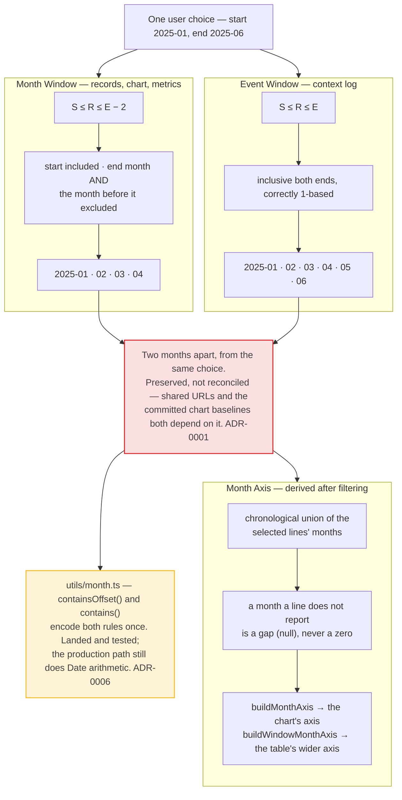
```mermaid
flowchart TB
  choice["One user choice — start 2025-01, end 2025-06"]

  subgraph monthWindow["Month Window — records, chart, metrics"]
    direction TB
    mwRule["S ≤ R ≤ E − 2"]
    mwMeaning["start included · end month AND<br/>the month before it excluded"]
    mwMonths["2025-01 · 02 · 03 · 04"]
    mwRule --> mwMeaning --> mwMonths
  end

  subgraph eventWindow["Event Window — context log"]
    direction TB
    ewRule["S ≤ R ≤ E"]
    ewMeaning["inclusive both ends, correctly 1-based"]
    ewMonths["2025-01 · 02 · 03 · 04 · 05 · 06"]
    ewRule --> ewMeaning --> ewMonths
  end

  keep["Two months apart, from the same choice.<br/>Preserved, not reconciled — shared URLs and the<br/>committed chart baselines both depend on it. ADR-0001"]

  subgraph axis["Month Axis — derived after filtering"]
    direction TB
    axisDef["chronological union of the<br/>selected lines' months"]
    axisGap["a month a line does not report<br/>is a gap (null), never a zero"]
    axisTwo["buildMonthAxis → the chart's axis<br/>buildWindowMonthAxis → the table's wider axis"]
    axisDef --> axisGap --> axisTwo
  end

  onePlace["utils/month.ts — containsOffset() and contains()<br/>encode both rules once. Landed and tested;<br/>the production path still does Date arithmetic. ADR-0006"]

  choice --> monthWindow
  choice --> eventWindow
  mwMonths --> keep
  ewMonths --> keep
  keep --> axis
  keep --> onePlace

  classDef cycle fill:#fbe0e1,stroke:#eb131b,stroke-width:1.5px,color:#44403c
  classDef pending fill:#fdf2d6,stroke:#fdb913,stroke-width:1.5px,color:#44403c
  class keep cycle
  class onePlace pending
```

---

## Line colour resolution

Nine rail and BRT lines carry hardcoded brand colours; every other line gets a deterministic
golden-angle hue, so a bus line looks the same on every render without anything being stored.
These are the colours this document is drawn in.

The honest part of the diagram is the right-hand branch. The map does **not** call `getLineColor`
— MapLibre paints from a `color` property baked into `metro_lines.geojson` by
`scripts/fetch_metro_lines.py`, which reimplements the same formula and the same brand table in
Python with a docstring reading "Must match lines.ts". Changing one desynchronises the map until
the geojson is regenerated, and no test would catch it.

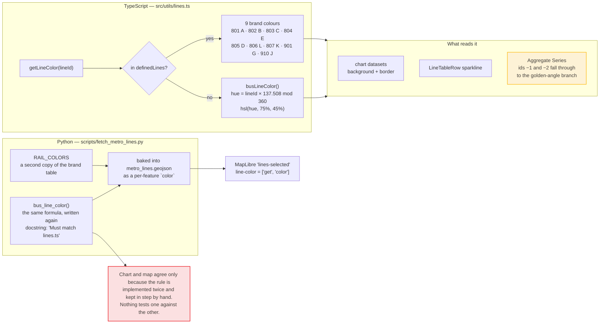
```mermaid
flowchart LR
  subgraph tsSide["TypeScript — src/utils/lines.ts"]
    direction TB
    getColor["getLineColor(lineId)"]
    lookup{"in definedLines?"}
    defined["9 brand colours<br/>801 A · 802 B · 803 C · 804 E<br/>805 D · 806 L · 807 K · 901 G · 910 J"]
    golden["busLineColor()<br/>hue = lineId × 137.508 mod 360<br/>hsl(hue, 75%, 45%)"]
    getColor --> lookup
    lookup -- yes --> defined
    lookup -- no --> golden
  end

  subgraph tsUses["What reads it"]
    direction TB
    chartDs["chart datasets<br/>background + border"]
    sparkline["LineTableRow sparkline"]
    aggregate["Aggregate Series<br/>ids −1 and −2 fall through<br/>to the golden-angle branch"]
  end

  subgraph pySide["Python — scripts/fetch_metro_lines.py"]
    direction TB
    pyRail["RAIL_COLORS<br/>a second copy of the brand table"]
    pyFn["bus_line_color()<br/>the same formula, written again<br/>docstring: 'Must match lines.ts'"]
    geoProp["baked into metro_lines.geojson<br/>as a per-feature `color`"]
    pyRail --> geoProp
    pyFn --> geoProp
  end

  mapLayer["MapLibre 'lines-selected'<br/>line-color = ['get', 'color']"]
  risk["Chart and map agree only because the rule is<br/>implemented twice and kept in step by hand.<br/>Nothing tests one against the other."]

  defined --> tsUses
  golden --> tsUses
  geoProp --> mapLayer
  pyFn --> risk

  classDef cycle fill:#fbe0e1,stroke:#eb131b,stroke-width:1.5px,color:#44403c
  classDef pending fill:#fdf2d6,stroke:#fdb913,stroke-width:1.5px,color:#44403c
  class risk cycle
  class aggregate pending
```

---

## Map lifecycle

The one imperative corner of an otherwise declarative app. MapLibre owns its own canvas, so
`Map.tsx` holds everything in refs and the component never re-renders on map state: one
`useEffect([])` builds the map, adds the two layers once the style has loaded, and tears it all
down on unmount.

Layer order is load-bearing — `lines-all` paints every route dimmed underneath, `lines-selected`
paints the chosen ones on top in brand colour, so selection reads as emphasis rather than as the
only thing on the map.

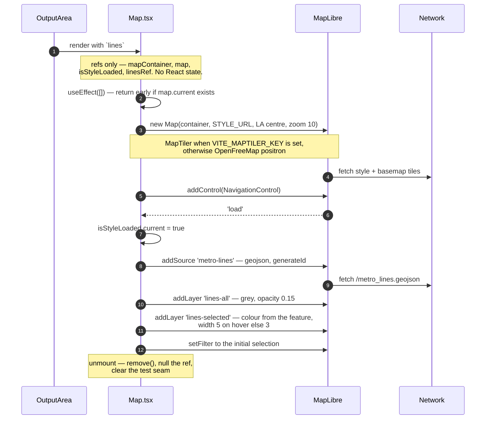
```mermaid
sequenceDiagram
  autonumber
  participant OA as OutputArea
  participant M as Map.tsx
  participant ML as MapLibre
  participant Net as Network

  OA->>M: render with `lines`
  Note over M: refs only — mapContainer, map,<br/>isStyleLoaded, linesRef. No React state.

  M->>M: useEffect([]) — return early if map.current exists
  M->>ML: new Map(container, STYLE_URL, LA centre, zoom 10)
  Note over M,ML: MapTiler when VITE_MAPTILER_KEY is set,<br/>otherwise OpenFreeMap positron
  ML->>Net: fetch style + basemap tiles
  M->>ML: addControl(NavigationControl)

  ML-->>M: 'load'
  M->>M: isStyleLoaded.current = true
  M->>ML: addSource 'metro-lines' — geojson, generateId
  ML->>Net: fetch /metro_lines.geojson
  M->>ML: addLayer 'lines-all' — grey, opacity 0.15
  M->>ML: addLayer 'lines-selected' — colour from the feature,<br/>width 5 on hover else 3
  M->>ML: setFilter to the initial selection

  Note over M: unmount — remove(), null the ref,<br/>clear the test seam
```

---

## Map interaction and the test seam

What happens after the map exists. Selection changes only update a layer filter; the map is never
rebuilt.

Two details are load-bearing. The hover handler reads `linesRef.current` rather than the `lines`
closure, because it is installed inside the `load` callback and would otherwise capture the
mount-time array forever. And `window.__metroMap` exists purely so `e2e/map.spec.ts` has something
to await — a WebGL canvas gives the DOM no signal that it has finished drawing. Nothing in the app
reads it; don't delete it.

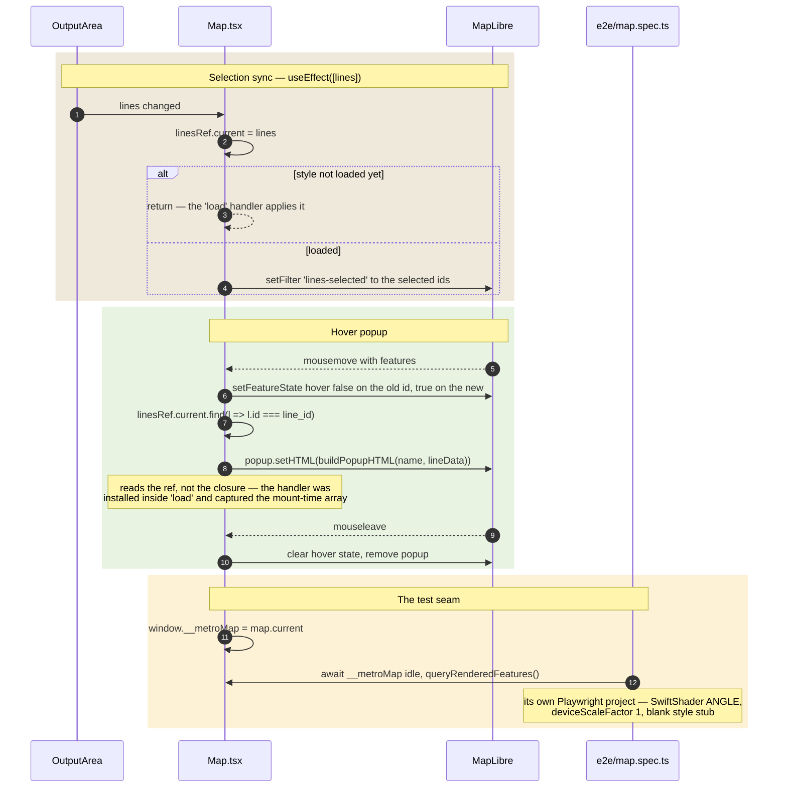
```mermaid
sequenceDiagram
  autonumber
  participant OA as OutputArea
  participant M as Map.tsx
  participant ML as MapLibre
  participant Spec as e2e/map.spec.ts

  rect rgb(239, 233, 219)
    Note over OA,ML: Selection sync — useEffect([lines])
    OA->>M: lines changed
    M->>M: linesRef.current = lines
    alt style not loaded yet
      M-->>M: return — the 'load' handler applies it
    else loaded
      M->>ML: setFilter 'lines-selected' to the selected ids
    end
  end

  rect rgb(232, 243, 226)
    Note over ML,M: Hover popup
    ML-->>M: mousemove with features
    M->>ML: setFeatureState hover false on the old id, true on the new
    M->>M: linesRef.current.find(l => l.id === line_id)
    M->>ML: popup.setHTML(buildPopupHTML(name, lineData))
    Note over M: reads the ref, not the closure — the handler was<br/>installed inside 'load' and captured the mount-time array
    ML-->>M: mouseleave
    M->>ML: clear hover state, remove popup
  end

  rect rgb(253, 242, 214)
    Note over M,Spec: The test seam
    M->>M: window.__metroMap = map.current
    Spec->>M: await __metroMap idle, queryRenderedFeatures()
    Note over Spec: its own Playwright project — SwiftShader ANGLE,<br/>deviceScaleFactor 1, blank style stub
  end
```

---

## Unit and Python suites

Vitest runs 20 co-located specs in jsdom. One of them is not a code test at all:
`src/data/transit-events.test.ts` refuses to let an event ship without a source URL — the type
makes `source` optional so fixtures stay cheap, and the guardrail closes the gap.

The Python side mirrors the pipeline exactly, one spec per script.

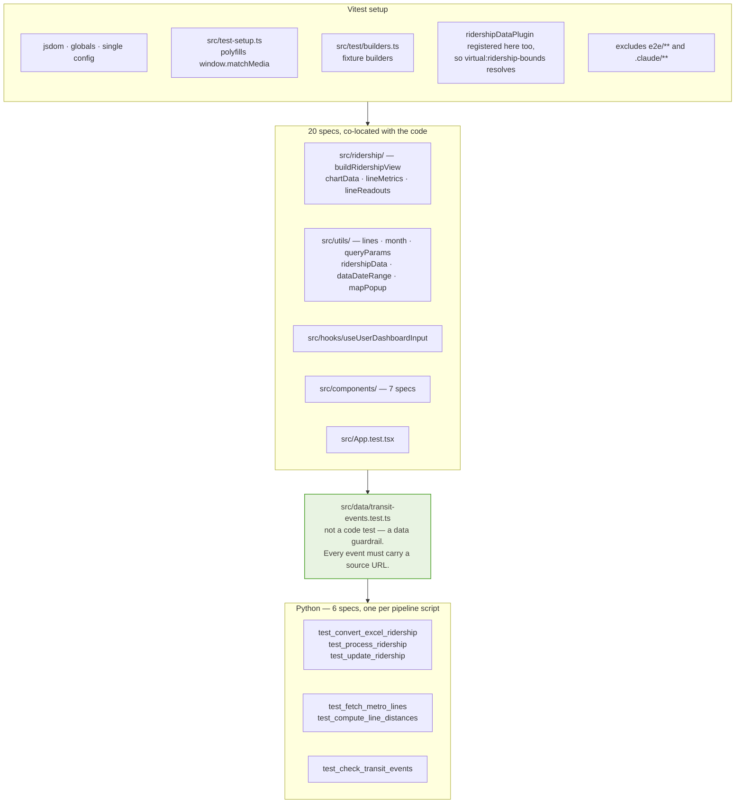
```mermaid
flowchart TB
  subgraph config["Vitest setup"]
    direction TB
    env["jsdom · globals · single config"]
    setup["src/test-setup.ts<br/>polyfills window.matchMedia"]
    builders["src/test/builders.ts<br/>fixture builders"]
    virt["ridershipDataPlugin registered here too,<br/>so virtual:ridership-bounds resolves"]
    excl["excludes e2e/** and .claude/**"]
  end

  subgraph specs["20 specs, co-located with the code"]
    direction LR
    uDomain["src/ridership/ — buildRidershipView<br/>chartData · lineMetrics · lineReadouts"]
    uUtils["src/utils/ — lines · month · queryParams<br/>ridershipData · dataDateRange · mapPopup"]
    uHook["src/hooks/useUserDashboardInput"]
    uComp["src/components/ — 7 specs"]
    uApp["src/App.test.tsx"]
  end

  guard["src/data/transit-events.test.ts<br/>not a code test — a data guardrail.<br/>Every event must carry a source URL."]

  subgraph py["Python — 6 specs, one per pipeline script"]
    direction LR
    pyRid["test_convert_excel_ridership<br/>test_process_ridership<br/>test_update_ridership"]
    pyGeo["test_fetch_metro_lines<br/>test_compute_line_distances"]
    pyEv["test_check_transit_events"]
  end

  config --> specs
  specs --> guard
  guard --> py

  classDef surface fill:#e8f3e2,stroke:#58a738,stroke-width:1.5px,color:#44403c
  class guard surface
```

---

## Visual regression

Nine specs across three projects. The map gets its own because it renders identical geometry at any
viewport, so running it twice would only double the flake surface.

Only `-linux.png` baselines are committed; Windows and macOS shots are git-ignored per-developer
scratch. A UI change that moves pixels therefore needs exactly one command,
`npm run test:e2e:update:linux`, which regenerates inside the same Docker image CI uses — the tag
resolved from the same `package-lock.json` the workflow reads.

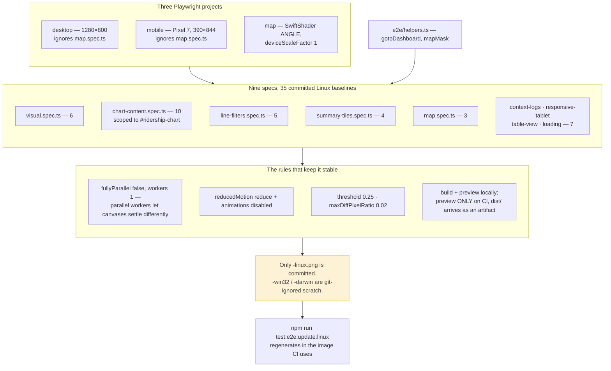
```mermaid
flowchart TB
  subgraph projects["Three Playwright projects"]
    direction TB
    desktop["desktop — 1280×800<br/>ignores map.spec.ts"]
    mobile["mobile — Pixel 7, 390×844<br/>ignores map.spec.ts"]
    mapProj["map — SwiftShader ANGLE,<br/>deviceScaleFactor 1"]
  end

  subgraph specs["Nine specs, 35 committed Linux baselines"]
    direction TB
    s1["visual.spec.ts — 6"]
    s2["chart-content.spec.ts — 10<br/>scoped to #ridership-chart"]
    s3["line-filters.spec.ts — 5"]
    s4["summary-tiles.spec.ts — 4"]
    s5["map.spec.ts — 3"]
    s6["context-logs · responsive-tablet<br/>table-view · loading — 7"]
  end

  subgraph rules["The rules that keep it stable"]
    direction TB
    serial["fullyParallel false, workers 1 —<br/>parallel workers let canvases settle differently"]
    motion["reducedMotion reduce + animations disabled"]
    tol["threshold 0.25 · maxDiffPixelRatio 0.02"]
    server["build + preview locally;<br/>preview ONLY on CI, dist/ arrives as an artifact"]
  end

  helpers["e2e/helpers.ts — gotoDashboard, mapMask"]
  baselines["Only -linux.png is committed.<br/>-win32 / -darwin are git-ignored scratch."]
  regen["npm run test:e2e:update:linux<br/>regenerates in the image CI uses"]

  projects --> specs
  helpers --> specs
  specs --> rules
  rules --> baselines --> regen

  classDef pending fill:#fdf2d6,stroke:#fdb913,stroke-width:1.5px,color:#44403c
  class baselines pending
```

---

## CI pipeline

Two jobs. `build` lints, unit-tests, builds and uploads `dist/`; `e2e` downloads that artifact and
runs the visual suite against `vite preview`, so the app is built exactly once per run.

The Playwright container tag is derived from `package-lock.json` by `jq` and passed between jobs as
an output, so the browser build that produced the committed baselines can never drift from the
installed client.

```mermaid
flowchart LR
  trigger["push to main<br/>pull_request to main"]
  conc["one in-flight run per ref —<br/>PR runs cancelled when superseded,<br/>main runs never are"]

  subgraph buildJob["Job: build — ubuntu-latest"]
    direction TB
    setup["checkout · setup-node from .node-version · npm ci"]
    resolve["resolve the Playwright version<br/>from package-lock.json → job output"]
    lint["npm run lint"]
    test["npm run test"]
    buildStep["npm run build<br/>tsc -b also type-checks e2e/"]
    upload["upload dist/"]
    setup --> resolve --> lint --> test --> buildStep --> upload
  end

  subgraph e2eJob["Job: e2e — needs build"]
    direction TB
    container["container playwright:v{version}-noble<br/>--ipc=host — the default 64MB /dev/shm<br/>crashes Chromium mid-screenshot"]
    prep["checkout · cache ~/.npm · npm ci<br/>browsers come from the image"]
    download["download dist/ · verify index.html"]
    runE2e["npm run test:e2e — preview only, never rebuilds"]
    onFail["on failure: upload report + the<br/>-actual / -diff triplets and traces"]
    container --> prep --> download --> runE2e --> onFail
  end

  noDeploy["No deploy job and no deploy target in the repo.<br/>CI never runs the Python pipeline —<br/>it consumes the committed JSON."]

  trigger --> conc --> setup
  upload -- "dist artifact + version output" --> container
  onFail --> noDeploy

  classDef pending fill:#fdf2d6,stroke:#fdb913,stroke-width:1.5px,color:#44403c
  class noDeploy pending
```

---

## Selecting a line, end to end

One click traced through every layer, to show how the pieces above compose. The user checks a box;
the hook mints a new `lines` array; the URL is rewritten; `buildRidershipView` re-derives the entire
view in one pass; chart, table, summary and map all update from that one result.

The `par` block is the write-back cycle seen live: rendering and re-deriving happen alongside each
other, and the loop settles only because the second pass produces figures identical to the first.

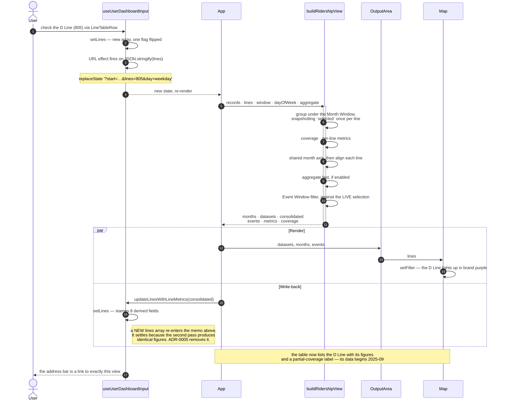
```mermaid
sequenceDiagram
  autonumber
  actor U as User
  participant Hook as useUserDashboardInput
  participant App as App
  participant View as buildRidershipView
  participant OA as OutputArea
  participant Map as Map

  U->>Hook: check the D Line (805) via LineTableRow
  Hook->>Hook: setLines — new array, one flag flipped
  Hook->>Hook: URL effect fires on JSON.stringify(lines)
  Note over Hook: replaceState '?start=…&lines=805&day=weekday'

  Hook-->>App: new state, re-render
  App->>View: records · lines · window · dayOfWeek · aggregate

  activate View
  View->>View: group under the Month Window,<br/>snapshotting `selected` once per line
  View->>View: coverage · per-line metrics
  View->>View: shared month axis, then align each line
  View->>View: aggregate last, if enabled
  View->>View: Event Window filter, against the LIVE selection
  View-->>App: months · datasets · consolidated<br/>events · metrics · coverage
  deactivate View

  par Render
    App->>OA: datasets, months, events
    OA->>Map: lines
    Map->>Map: setFilter — the D Line lights up in brand purple
  and Write-back
    App->>Hook: updateLinesWithLineMetrics(consolidated)
    Hook->>Hook: setLines — stamps 8 derived fields
    Note right of Hook: a NEW lines array re-enters the memo above.<br/>It settles because the second pass produces<br/>identical figures. ADR-0005 removes it.
  end

  Note over App,Map: the table now lists the D Line with its figures<br/>and a partial-coverage label — its data begins 2025-09
  Hook-->>U: the address bar is a link to exactly this view
```

---

## Documentation and decision map

Which document governs what, and where the code has not caught up. `CONTEXT.md` outranks the source
by its own rule — where a term there conflicts with a name in the code, the code is what's out of
date.

All six ADRs are accepted, but two are only half-landed: 0005's `buildLineReadouts` and 0006's
`month.ts` both exist with full test coverage and no production caller. That gap is the most
actionable thing in this whole set.

```mermaid
flowchart TB
  subgraph authority["Authority order"]
    direction TB
    ctx["CONTEXT.md — the ubiquitous language.<br/>Where a term conflicts with a name in the<br/>source, the term wins."]
    adrs["docs/adr/ — six decisions, all accepted"]
    claude["CLAUDE.md — working notes"]
    readme["README.md — runbooks"]
    ctx --> adrs --> claude --> readme
  end

  subgraph landed["Decided and in force"]
    direction TB
    a1["0001 — the offset Month Window<br/>→ buildRidershipView.ts"]
    a2["0002 — the view returns Chart.js types<br/>→ RidershipView.datasets"]
    a3["0003 — one domain folder<br/>→ src/ridership/index.ts"]
    a4["0004 — one nullable Line Metrics shape<br/>→ lineMetrics.ts"]
  end

  subgraph half["Accepted, machinery landed, no production caller"]
    direction TB
    a5["0005 — figures live on a Line Readout.<br/>buildLineReadouts and listedReadouts are<br/>written and tested; App.tsx:94 still writes back."]
    a6["0006 — a month is {year, month}.<br/>utils/month.ts has both rules and its own spec;<br/>the filters still do Date arithmetic."]
  end

  subgraph planning["Planning — intent, not decisions"]
    direction TB
    review["architecture-review-2026-08-05.md<br/>six candidates; 1 landed,<br/>5 (URL contract) and 6 (CSV seam) unscheduled"]
    plans["src/plans/ — 7 design notes"]
    agents["docs/agents/ · perf/BASELINE.md"]
  end

  adrs --> landed
  adrs --> half
  plans --> review --> adrs

  classDef authorityC fill:#f0e5f1,stroke:#a05da5,stroke-width:1.5px,color:#44403c
  classDef pending fill:#fdf2d6,stroke:#fdb913,stroke-width:1.5px,color:#44403c
  classDef surface fill:#e8f3e2,stroke:#58a738,stroke-width:1.5px,color:#44403c
  class ctx authorityC
  class a5,a6 pending
  class landed surface
```

---

Generated by `scripts/build_architecture_docs.mjs` from `mermaid/` + `captions.md`.
