<!--
  GENERATED FILE — do not edit. Built by scripts/build_architecture_docs.mjs.
  Edit the diagram in docs/architecture/mermaid/<name>.mmd or the prose in
  docs/architecture/captions.md, then run `npm run docs:architecture`.
-->

# metro_ridership_app — architecture

A whole-system view plus one diagram per subsystem. GitHub renders the fences below;
`architecture.html` and `architecture.pdf` in this folder are the same content, rendered.

## Contents

1. [The whole system](#the-whole-system)
2. [Repository map](#repository-map)
3. [The Python data pipeline](#the-python-data-pipeline)
4. [The build pipeline](#the-build-pipeline)
5. [Runtime data flow](#runtime-data-flow)
6. [Component tree](#component-tree)
7. [State model](#state-model)
8. [The URL contract](#the-url-contract)
9. [Domain type model](#domain-type-model)
10. [The `src/ridership/` seam](#the-srcridership-seam)
11. [Month Window, Event Window, Month Axis](#month-window-event-window-month-axis)
12. [Line colour resolution](#line-colour-resolution)
13. [The map subsystem](#the-map-subsystem)
14. [Test topology](#test-topology)
15. [CI pipeline](#ci-pipeline)
16. [Selecting a line, end to end](#selecting-a-line-end-to-end)
17. [Documentation and decision map](#documentation-and-decision-map)

---

## The whole system

The one view that contains everything else. Three stages, and the boundaries between them are
what matter: a **Python pipeline** that runs by hand and writes JSON into the repo, a **Vite
build** that re-encodes that JSON into a wire format, and a **browser** that fetches it and
derives everything on screen from one set of user choices.

There is no backend. The repository *is* the database, `dist/` is the whole deployment, and the
URL query string is the only thing that survives a page reload. Every remaining diagram drills
into one box here.

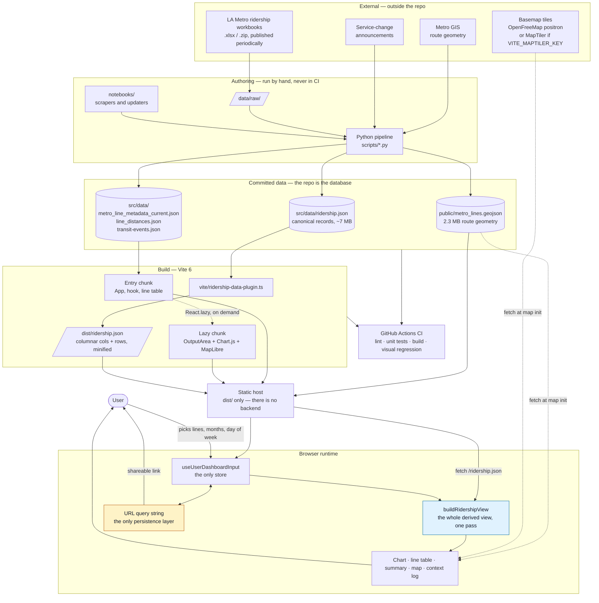

---

## Repository map

What lives where. Two things are worth noticing. `src/` is flat — `components/`, `hooks/`,
`utils/`, `data/`, `@types/` — with exactly one domain folder, `src/ridership/`, and ADR-0003 says
that is deliberate and not the first step of a reorganisation. And the repo carries an unusual
amount of prose: `CONTEXT.md`, six ADRs, an architecture review, seven design plans. That is the
system's memory; read it before changing behaviour that looks wrong.

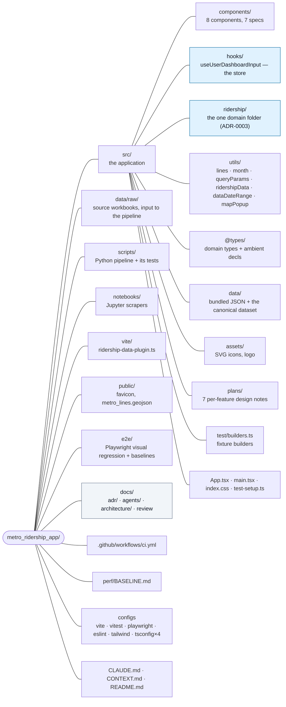

---

## The Python data pipeline

How data gets into the repo. Nothing here runs in CI — a human runs these scripts and commits
the result, which is why `src/data/ridership.json` is a checked-in 7 MB file rather than a build
artifact.

The ridership chain is the main line; three side chains produce the geometry, the per-line route
lengths, and the transit-events file. Every script has a `test_*.py` sibling.

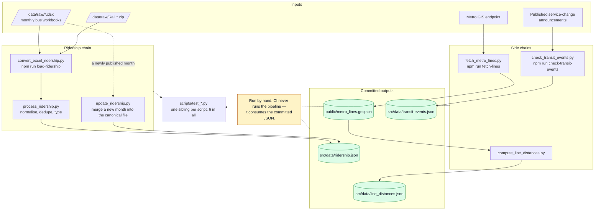

---

## The build pipeline

`vite/ridership-data-plugin.ts` is the interesting part. The canonical JSON repeats six field
names on every one of ~42K rows and, imported normally, would inline about 6.6 MB of object
literal into the entry chunk. The plugin reads it once and produces two things from that single
pass: a minified columnar blob served at `/ridership.json`, and a `virtual:ridership-bounds`
module carrying just the min/max year and latest month.

The blob reaches the app two different ways — dev middleware in `configureServer`, an emitted
asset in `generateBundle` — so the runtime `fetch` is identical in both. The plugin is registered
in `vitest.config.ts` as well, or the virtual module would not resolve under the test runner.

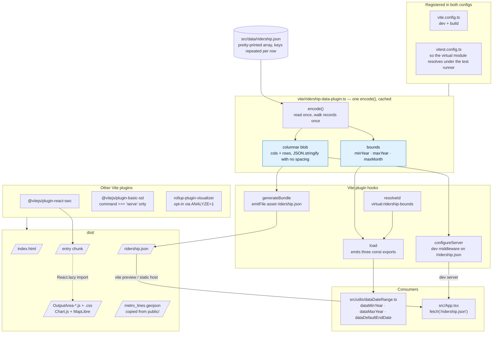

---

## Runtime data flow

The core architecture. Records are fetched (never bundled), decoded, and handed with the user's
choices to a single `buildRidershipView` call that produces the whole derived view in one pass.

Two things stand out. `buildRidershipView` already returns `metrics` and `coverage` keyed by line
id — everything a caller needs — yet `App.tsx:94` still calls `updateLinesWithLineMetrics`, which
writes eight derived fields back onto every `Line`. That write-back mints a new `lines` array,
which re-enters the memo it came from; the four `JSON.stringify` dependency keys exist to keep
that loop from thrashing. ADR-0005 accepted removing it, and `buildLineReadouts` is the
replacement — built, tested, and not yet imported by anything that renders.

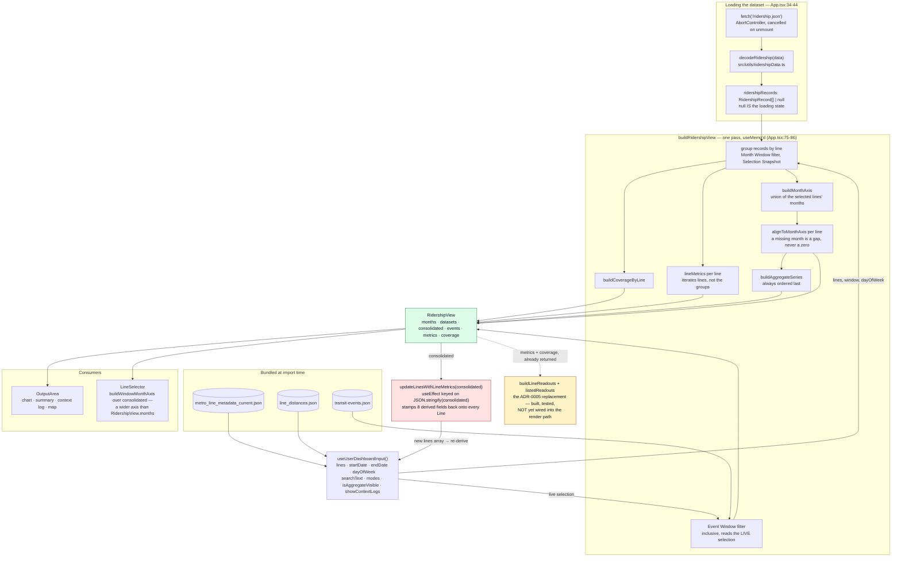

---

## Component tree

Eight components, no router, no context providers. `App` spreads the entire hook state into
`LineSelector` with `{...userDashboardInputState}`, so that component's real interface is much
wider than its props list suggests.

`OutputArea` is `React.lazy` on purpose: it pulls in Chart.js and MapLibre, and keeping them out
of the entry chunk lets the header and line table paint first. Note the branch on
`isLineSelectorExpanded` — expanding the selector *unmounts* `OutputArea` entirely rather than
hiding it, so the chart and map rebuild from scratch on collapse. `App.tsx:136-138` flags this.

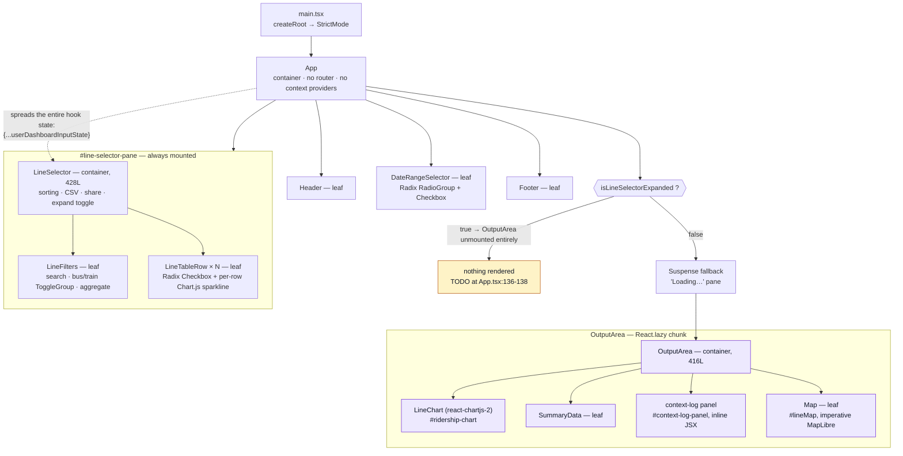

---

## State model

All shared state lives in one custom hook. No Redux, no Zustand, no Context — four slices
(window, lines, filters, toggles), a set of mutators, and two effects.

The `JSON.stringify` dependency keys at `App.tsx:96`, `useUserDashboardInput.ts:168` and `:264`
are load-bearing, not sloppiness: `lines` is a fresh array on every derivation, so reference
equality would fire these effects forever. `CLAUDE.md` asks you not to "fix" them. The real fix
is removing the write-back that mints the array (ADR-0005), not changing the keys.

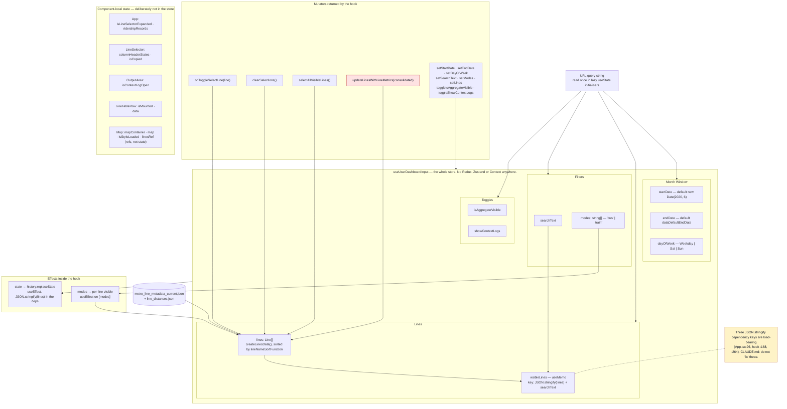

---

## The URL contract

Nine parameters, read once into lazy `useState` initialisers and written back with
`history.replaceState` on every change. There is no router, no `localStorage` and no server, so
this is the app's entire persistence layer — and the reason every view is a shareable link.

The contract is asymmetric by design: `buses`/`trains` are written only when *off*,
`aggregate`/`logs` only when *on*, keeping the common URL short. Malformed values fall back to
defaults rather than throwing. Nine ad-hoc reads and one hand-built writer are what candidate 5
of the architecture review would replace with an explicit parsed contract; it is unscheduled.

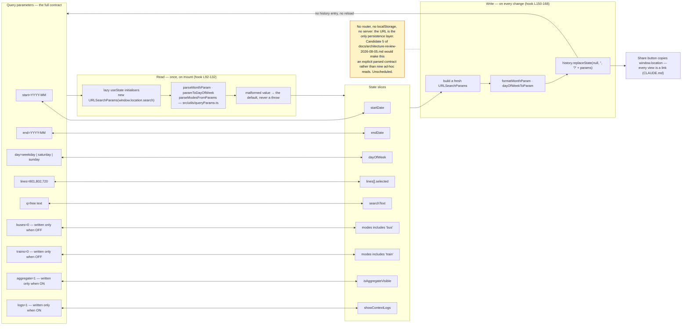

---

## Domain type model

The types and how they relate. Read `Line` from the top down: identity and metadata first, then
a block of optional derived figures that ADR-0005 says do not belong there. `LineSelection` is
the same information minus the derived block — it is what `buildRidershipView` actually accepts,
and `Line` satisfies it structurally, which is what keeps derived figures from being handed back
into the module that produced them.

`LineReadout` is the intended destination: `Line & Partial<LineMetrics> & Partial<LineCoverage>`,
derived per window and thrown away. `Month` is ADR-0006's replacement for the seven encodings a
month currently has. Both exist; neither is wired in.

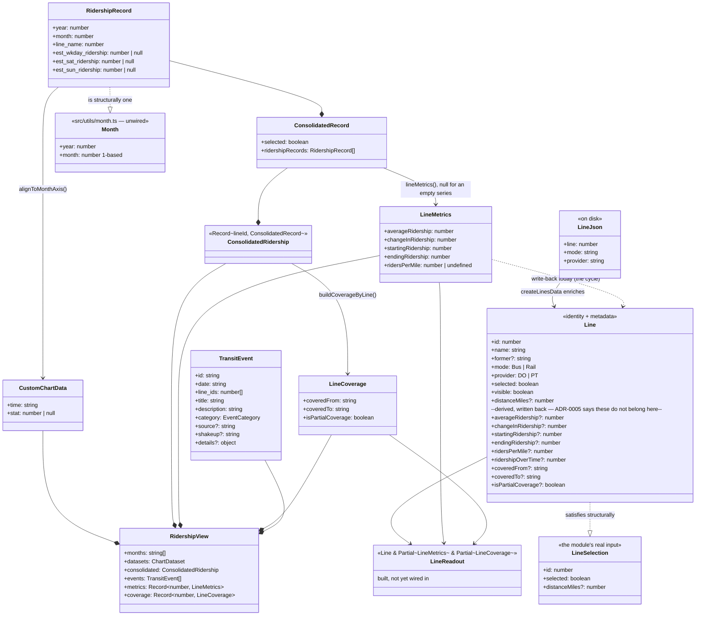

---

## The `src/ridership/` seam

`index.ts` is the module's entire public surface. Everything else in the folder is
implementation, so an import of `../ridership/chartData` from outside is *visibly* reaching past
a seam — which is the whole point of the folder existing (ADR-0003). A flat
`src/utils/ridershipView.ts` could only have asked for that in a comment.

The three month-axis and coverage exports are a deliberate second entry point rather than a leak.
`buildRidershipView` derives the **chart**, over the **selected** lines only; the line table draws
a sparkline for every **visible** line and needs the wider union across all of `consolidated`.

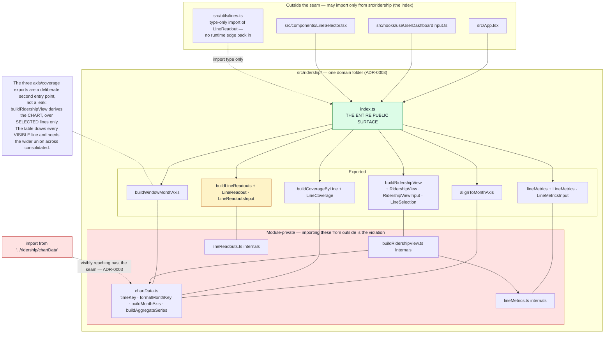

---

## Month Window, Event Window, Month Axis

The single most surprising thing in the codebase. One user choice produces two windows that
disagree by two months: records use `S ≤ R ≤ E − 2` (the start month is in; the end month **and
the month before it** are out), while the context log uses an ordinary inclusive range.

This reads like an off-by-one and is not. It is long-standing behaviour, users have shared URLs
against it, and `e2e/chart-content.spec.ts` renders windows through it into committed PNG
baselines — normalising it would change what every existing link shows. ADR-0001 accepts it and
`src/utils/month.ts` now encodes both rules once, as `containsOffset` and `contains`, though the
production filters still do the original `Date` and `YYYYMM` arithmetic.

The Month Axis is derived after filtering: one shared axis for every series, because Chart.js
appends any label missing from `labels` to the end and a per-series axis scrambles the rest. A
month a line does not report is a gap, never a zero.

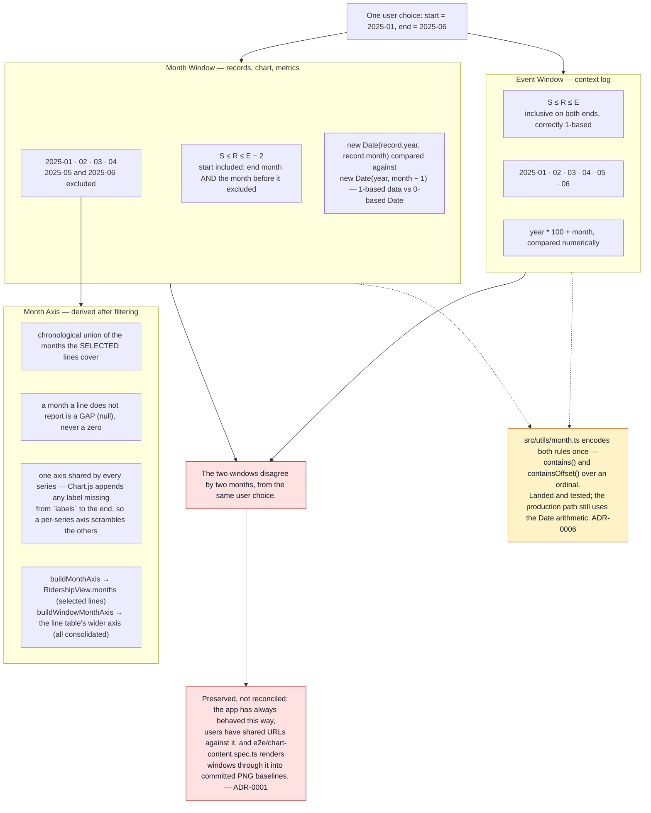

---

## Line colour resolution

Nine rail and BRT lines carry hardcoded brand colours; every other line gets a deterministic
golden-angle hue, so a bus line looks the same on every render without anything being stored.

The honest part of this diagram is the right-hand branch. The map does **not** call
`getLineColor` — MapLibre paints from a `color` property baked into `metro_lines.geojson` by
`scripts/fetch_metro_lines.py`, which reimplements the same formula and the same brand table in
Python with a docstring reading "Must match lines.ts". Nothing tests the two against each other,
so changing one desynchronises the map until the geojson is regenerated.

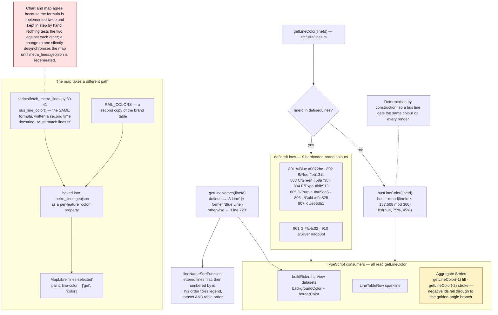

---

## The map subsystem

The one imperative corner of an otherwise declarative app. MapLibre owns its own canvas, so
`Map.tsx` holds everything in refs and never re-renders: one `useEffect([])` builds the map, a
second `useEffect([lines])` syncs the selection filter.

Two details are load-bearing. The hover handler reads `linesRef.current` rather than the `lines`
closure, because the handler is installed inside the `load` callback and would otherwise capture
the mount-time array forever. And `window.__metroMap` exists purely so `e2e/map.spec.ts` has
something to await — a WebGL canvas offers the DOM no signal that it has finished drawing.

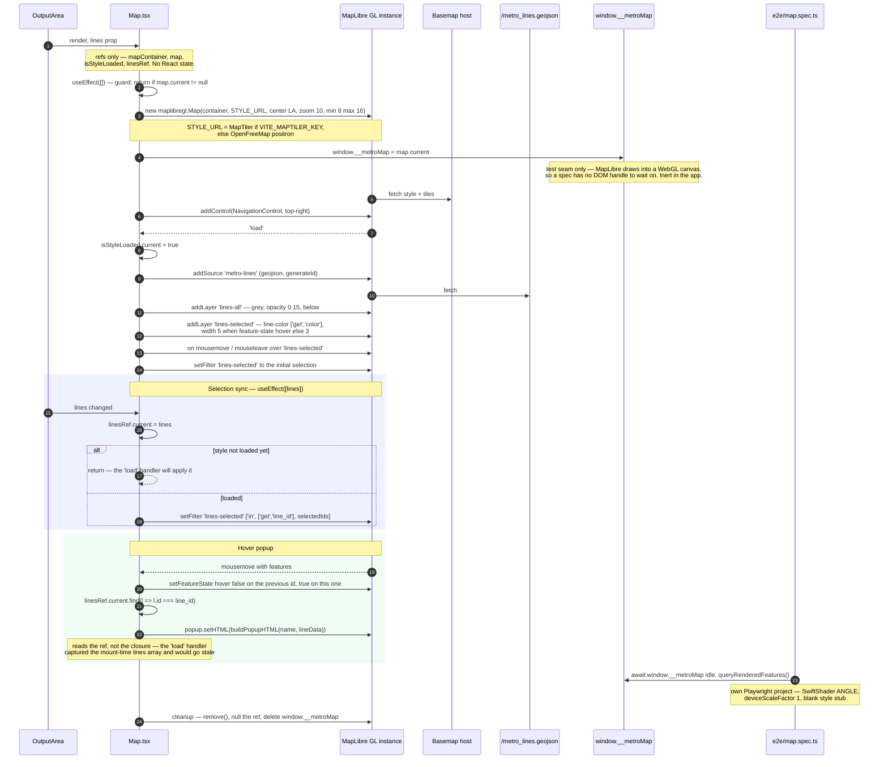

---

## Test topology

Three suites that never overlap. Vitest runs 20 co-located specs in jsdom, including one that is
not a code test at all: `src/data/transit-events.test.ts` refuses to let an unsourced event ship.
Playwright runs 9 visual-regression specs across three projects — the map gets its own because it
renders identical geometry at any viewport. Six Python specs cover the pipeline.

Only `-linux.png` baselines are committed; Windows and macOS shots are git-ignored per-developer
scratch. A UI change that moves pixels therefore needs exactly one command,
`npm run test:e2e:update:linux`, which regenerates inside the same Docker image CI uses.

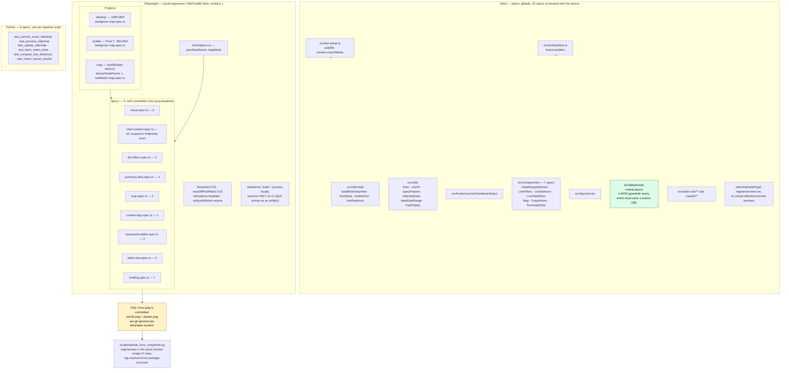

---

## CI pipeline

Two jobs. `build` lints, unit-tests, builds, and uploads `dist/`; `e2e` downloads that artifact
and runs the visual suite against `vite preview` — the app is built exactly once per run.

The Playwright container tag is derived from `package-lock.json` by `jq` and passed between jobs
as an output, so the browser build that produced the committed baselines can never drift from the
installed client. `--ipc=host` is not optional: Docker's default 64 MB `/dev/shm` crashes Chromium
mid-screenshot.

There is no deploy job and no deploy target in the repo, and CI never runs the Python pipeline.

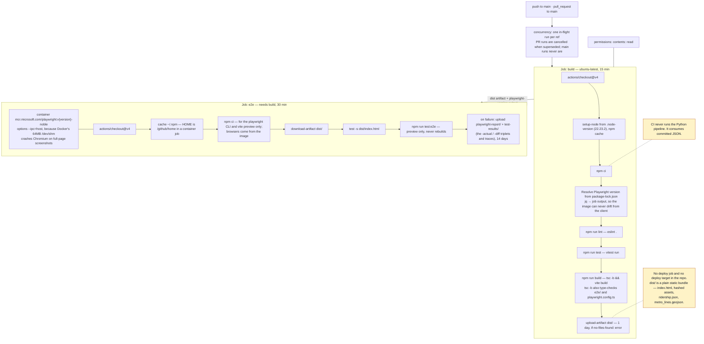

---

## Selecting a line, end to end

One click traced through every layer, to show how the pieces above compose. The user checks a
box; the hook mints a new `lines` array; the URL is rewritten; `buildRidershipView` re-derives
the entire view in one pass; the chart, table, summary and map all update from that one result.

The `par` block is the write-back cycle seen live: rendering and re-deriving happen alongside
each other, and the loop settles only because the second pass produces figures identical to the
first, so the stringified dependency key stops changing.

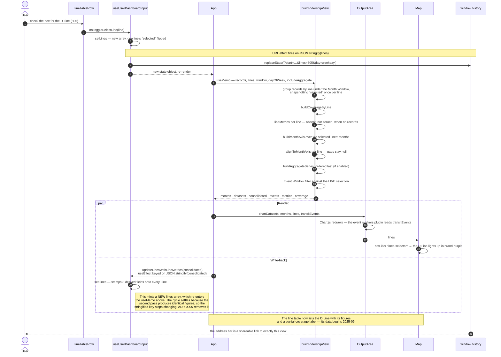

---

## Documentation and decision map

Which document governs what, and where the code has not caught up. `CONTEXT.md` outranks the
source by its own rule — where a term there conflicts with a name in the code, the code is what's
out of date.

All six ADRs are accepted, but two are only half-landed: 0005's `buildLineReadouts` and 0006's
`month.ts` both exist with full test coverage and no production caller. That gap is the most
actionable thing in this whole set. Separately, `CLAUDE.md` still refers to `src/utils/calc.ts`,
which ADR-0004 deleted.

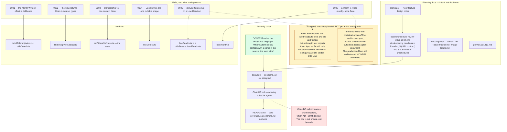

---

Generated by `scripts/build_architecture_docs.mjs` from `mermaid/` + `captions.md`.
